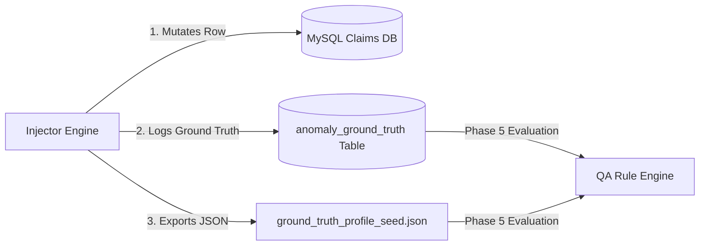

# ClaimIQ — Anomaly Ground Truth Model & Registry

## 1. Ground Truth Architecture & Purpose

Phase 4 introduces an explicit **Ground Truth Registry** that captures the exact footprint of every intentionally injected anomaly. This registry forms the empirical baseline that Phase 5 QA rules will evaluate to compute **True Positives, False Positives, False Negatives, Precision, and Recall**.



---

## 2. Relational Schema: `anomaly_ground_truth`

```sql
CREATE TABLE IF NOT EXISTS anomaly_ground_truth (
    ground_truth_id BIGINT UNSIGNED NOT NULL AUTO_INCREMENT,
    anomaly_code VARCHAR(16) NOT NULL,
    category_name VARCHAR(64) NOT NULL,
    severity_code VARCHAR(16) NOT NULL,
    target_table VARCHAR(64) NOT NULL,
    target_record_id BIGINT UNSIGNED NOT NULL,
    target_business_reference VARCHAR(64) NULL,
    target_column VARCHAR(64) NOT NULL,
    original_value TEXT NULL,
    mutated_value TEXT NULL,
    injection_profile VARCHAR(32) NOT NULL,
    injection_seed INT NOT NULL,
    description VARCHAR(255) NOT NULL,
    expected_rule_category VARCHAR(64) NOT NULL,
    injected_at DATETIME(6) NOT NULL DEFAULT CURRENT_TIMESTAMP(6),
    is_active BOOLEAN NOT NULL DEFAULT 1,
    CONSTRAINT pk_anomaly_ground_truth PRIMARY KEY (ground_truth_id),
    CONSTRAINT fk_agt_severity FOREIGN KEY (severity_code) REFERENCES ref_severities (severity_code) ON DELETE RESTRICT ON UPDATE CASCADE
) ENGINE=InnoDB DEFAULT CHARSET=utf8mb4 COLLATE=utf8mb4_0900_ai_ci;
```

---

## 3. JSON Ground Truth Structure

Ground truth runs are automatically exported to `reports/ground_truth_<profile>_<seed>.json`:

```json
{
  "record_count": 201,
  "anomalies": [
    {
      "ground_truth_id": null,
      "anomaly_code": "E023",
      "category_name": "Financial / Reconciliation",
      "severity_code": "Critical",
      "target_table": "payments",
      "target_record_id": 142,
      "target_business_reference": "PMT-2025-0000142",
      "target_column": "paid_amount",
      "original_value": "850.00",
      "mutated_value": "1350.00",
      "injection_profile": "moderate",
      "injection_seed": 42,
      "description": "Payment (1350.00) mutated to exceed claim billed total (1000.00)",
      "expected_rule_category": "Financial Integrity",
      "injected_at": null,
      "is_active": true
    }
  ]
}
```

---

## 4. Ground Truth-Based Reversion (`--reset-anomalies`)

The ground truth records serve as a complete **undo log**:
1. For updated values: `UPDATE <target_table> SET <target_column> = <original_value> WHERE <pk> = <target_record_id>`.
2. For newly inserted records (`original_value = 'NEW_RECORD'`): `DELETE FROM <target_table> WHERE <pk> = <target_record_id>`.
3. Marks active ground truth rows as `is_active = 0`.
4. Re-running the Phase 3 validation suite after reset confirms 100% clean baseline restoration.
