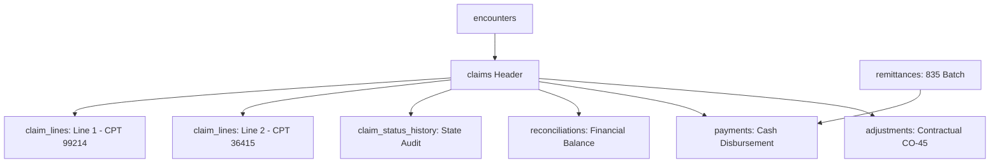

# ClaimIQ — Claim Data Model & Financial Reconciliation Specification

## 1. Relational Structure of Claims

The claim data model in ClaimIQ mirrors standard healthcare electronic claims structures (EDI 837 / CMS-1500 / UB-04 equivalent) normalized across five core relational tables in MySQL 8.x:
1. `claims`: High-level billing claim header representing an encounter billing episode.
2. `claim_lines`: Itemized procedural service lines (CPT/HCPCS codes, units, charges).
3. `claim_status_history`: Complete state transition audit log for claims.
4. `payments`: Disbursed monetary allocations linked to claims and remittances.
5. `reconciliations`: Mathematical balancing records auditing billed vs. settled amounts.



---

## 2. Header-to-Line Itemization Invariants

In a valid healthcare claim, the claim header total charge is strictly the arithmetic sum of its constituent itemized service lines:

$$\text{claims.total\_billed\_amount} = \sum_{i=1}^{N} \text{claim\_lines.line\_billed\_amount}_i$$

Where each line charge satisfies:
$$\text{line\_billed\_amount} = \text{units} \times \text{unit\_price}$$

### Database Integrity vs. QA Anomaly Detection
- **Database CHECK Constraint**: `CHECK (total_billed_amount >= 0.00)` and `CHECK (line_billed_amount >= 0.00)` prevent negative monetary values.
- **QA Rule `RULE-FIN-005`**: In Phase 5, the QA engine compares `claims.total_billed_amount` against $\sum \text{line\_billed\_amount}$ to detect line-item desynchronization injected in Phase 4.

---

## 3. Claim State Transition & History Tracking

Claim statuses are validated via foreign key to `ref_claim_statuses` (`Submitted`, `Accepted`, `Rejected`, `Pending`, `Denied`, `Paid`, `Partially Paid`).

Whenever `claims.current_status_code` is updated:
1. A transaction updates `claims.current_status_code`.
2. A new record is inserted into `claim_status_history`:
   ```sql
   INSERT INTO claim_status_history (
       claim_id, previous_status_code, new_status_code,
       transition_timestamp, transition_reason, actor_reference
   ) VALUES (
       1001, 'Submitted', 'Accepted',
       UTC_TIMESTAMP(6), '277CA Acceptance Received', 'CLEARINGHOUSE_RECEIVER'
   );
   ```

---

## 4. Financial Reconciliation Model

Reconciliation verifies that every dollar billed on a claim is fully accounted for by cash payments, contractual adjustments, and patient responsibilities:

$$\text{Billed Amount} = \text{Paid Amount} + \text{Contractual Adjustments} + \text{Patient Responsibility} + \text{Variance Balance}$$

Where:
- $\text{Paid Amount} = \sum \text{payments.paid\_amount}$
- $\text{Contractual Adjustments} = \sum \text{adjustments.adjustment\_amount}$ where `group_code = 'CO'`
- $\text{Patient Responsibility} = \sum \text{adjustments.adjustment\_amount}$ where `group_code = 'PR'`
- $\text{Variance Balance} (\Delta) = \text{Billed} - (\text{Paid} + \text{Adjustments} + \text{PatientResp})$

### Reconciliation Status Categories
- **`BALANCED`**: $\left|\Delta\right| \le \$0.01$ (Account fully settled; ready for closure).
- **`UNBALANCED`**: $\Delta > \$0.01$ (Outstanding unpaid balance or unaccounted write-off).
- **`DISPUTED / OVERPAID`**: $\Delta < -\$0.01$ (Total paid/adjusted exceeds billed charge; potential overpayment requiring refund).

The `reconciliations` table stores snapshots of these calculations, allowing rapid reporting and tracking of financial leakage across synthetic provider and payer portfolios.
