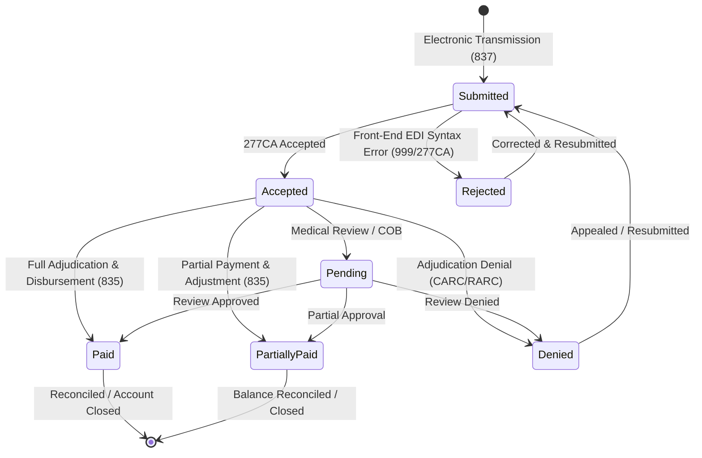

# ClaimIQ — Claim Lifecycle & State Machine Specification

## 1. Overview of Claim States

In healthcare Revenue Cycle Management, every claim moves through a series of discrete lifecycle states from initial electronic submission through payer adjudication and final financial balance resolution.

ClaimIQ models seven core operational claim states:
1. **Submitted**: The claim has been electronically compiled and transmitted to the payer/clearinghouse.
2. **Accepted**: The claim passed front-end clearinghouse formatting and payer pre-adjudication edits.
3. **Rejected**: The claim failed front-end EDI validation and was returned prior to entering formal payer adjudication.
4. **Pending**: The claim is currently undergoing payer medical review, coordination of benefits (COB), or awaiting additional documentation.
5. **Denied**: The claim completed payer adjudication, but reimbursement was formally refused.
6. **Paid**: The claim was fully adjudicated and payment was disbursed in full according to the contracted fee schedule.
7. **Partially Paid**: The claim was adjudicated with partial payment, leaving an allowed contractual adjustment and/or patient responsibility balance.

---

## 2. Finite State Machine (FSM) Diagram

---

## 3. Valid State Transition Matrix

The table below specifies valid state transitions, their operational triggers, and expected data updates:

| Current State | Target State | Permitted? | Trigger Event / Business Driver | Required Data Updates |
| :--- | :--- | :---: | :--- | :--- |
| **(New Claim)** | `Submitted` | Yes | Initial electronic claim transmission batch. | `submission_date` populated; `claim_status = 'Submitted'`. |
| `Submitted` | `Accepted` | Yes | Clearinghouse 277CA acceptance confirmation. | `accepted_date` populated; status updated. |
| `Submitted` | `Rejected` | Yes | EDI validation syntax or NPI lookup failure. | `rejection_reason_code` recorded; no financial entries. |
| `Accepted` | `Pending` | Yes | Payer requests additional clinical records / COB. | `pending_reason` populated; adjudication clock paused. |
| `Accepted` | `Paid` | Yes | Electronic Remittance Advice (ERA 835) with full payment. | `payment_id`, `paid_amount`, `payment_date` recorded. |
| `Accepted` | `Partially Paid` | Yes | ERA 835 with partial payment and adjustment. | `paid_amount`, `adjustment_amount`, `patient_resp` populated. |
| `Accepted` | `Denied` | Yes | ERA 835 with zero payment and denial CARC/RARC code. | `denial_code`, `denial_reason`, `denial_date` populated. |
| `Pending` | `Paid` / `Partially Paid` / `Denied` | Yes | Payer completes secondary medical/policy review. | Adjudication fields updated per outcome. |
| `Rejected` | `Submitted` | Yes | Analyst corrects formatting/NPI defect and resubmits. | New `resubmission_date`; previous rejection archived. |
| `Denied` | `Submitted` | Yes | Formal appeal or corrected claim submitted. | Linked appeal tracking ID generated. |

---

## 4. Invalid State Combinations & Anomaly Indicators

In ClaimIQ, deviations from the valid state machine are flagged as **Business Logic & State Anomalies**:

| Invalid Combination / Transition | Description | Operational Defect Identified | Severity |
| :--- | :--- | :--- | :---: |
| **`Submitted` $\rightarrow$ `Paid` (Skipping `Accepted`)** | Claim is marked paid without an acceptance or adjudication record. | Missing intermediate 277CA clearinghouse transaction log. | **Medium** |
| **`Rejected` with Disbursed Payment** | Claim has status `Rejected` but contains a non-zero `paid_amount`. | Corrupted payment posting; payment applied to non-adjudicated claim. | **Critical** |
| **`Denied` with Disbursed Payment** | Claim has status `Denied` but contains `paid_amount > $0.00`. | Contradictory financial state; ledger discrepancy. | **Critical** |
| **`Paid` with Zero Remittance** | Claim is marked `Paid`, but `paid_amount = $0.00` and `adjustment_amount = $0.00`. | Premature status closure; missing cash remittance. | **High** |
| **`Pending` with Check / Remittance** | Claim is marked `Pending`, but already has an associated `payment_date`. | Desynchronized pipeline state. | **High** |
| **`Rejected` $\rightarrow$ `Paid` directly** | Direct jump from front-end rejection to paid without resubmission. | Impossible workflow transition; database update corruption. | **Critical** |

---

## 5. Terminal vs. Active States

- **Active / Open States**: `Submitted`, `Accepted`, `Pending`. These represent work-in-progress claims awaiting payer determination or provider action.
- **Adjudicated States**: `Paid`, `Partially Paid`, `Denied`. These represent completed payer determinations requiring financial reconciliation.
- **Terminal State**: A claim reaches true operational closure once it is in an adjudicated state and the reconciliation equation $\Delta = \$0.00$ is fully satisfied and verified.
