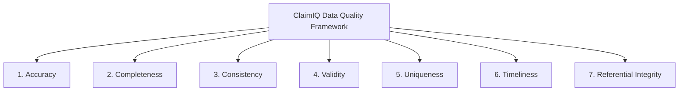

# ClaimIQ — Data Quality Framework

## 1. Principles of Healthcare Data Quality

In healthcare data operations, data quality is not merely a technical hygiene metric; it directly impacts financial solvency, regulatory compliance, operational efficiency, and provider-payer relationships.

The ClaimIQ platform establishes a formal data quality framework based on the **7 Core Dimensions of Healthcare Data Quality**.

---

## 2. The 7 Data Quality Dimensions

### 2.1 Accuracy
- **Definition**: The degree to which data correctly reflects the real-world healthcare interaction and true financial agreement.
- **Healthcare Context**: Billed amounts matching contracted fee schedules; procedure codes reflecting exact clinical services; payment amounts matching actual electronic remittance disbursements.
- **Example Defect**: A claim billed for a routine 15-minute office visit (`99213`) billed at \$15,000 due to decimal shift, or payment recorded as \$500 when remittance advice specifies \$50.

### 2.2 Completeness
- **Definition**: The extent to which all required data attributes and itemized lines are populated without omission.
- **Healthcare Context**: A claim must include all mandatory fields required for EDI 837 compliance: Patient ID, Rendering Provider NPI, Primary ICD-10 Diagnosis Code, Date of Service, Place of Service, and at least one itemized Claim Line.
- **Example Defect**: A submitted claim with `diagnosis_code` set to `NULL` or a claim header missing associated `claim_line` entries.

### 2.3 Consistency
- **Definition**: The absence of contradiction across disparate data fields, related records, or linked transactional feeds within the system.
- **Healthcare Context**: Mathematical reconciliation across billing amounts:
  $$\text{Billed Amount} = \text{Paid Amount} + \text{Contractual Adjustment} + \text{Patient Responsibility}$$
  Also ensures claim status aligns with financial state (e.g., a status of `Paid` must not have \$0 paid amount without an adjustment).
- **Example Defect**: A claim marked `Denied` that concurrently contains a positive disbursed payment amount.

### 2.4 Validity
- **Definition**: Conformance of data elements to predefined formats, schemas, syntax rules, and standard medical coding domain dictionaries.
- **Healthcare Context**: Provider NPIs must conform to the 10-digit National Provider Identifier format validated via the Luhn checksum; CPT codes must match 5-digit American Medical Association (AMA) syntax; ICD-10 codes must follow WHO/CMS alphanumeric formats.
- **Example Defect**: An NPI recorded as `12345ABC` or a CPT code with 3 digits (`992`).

### 2.5 Uniqueness
- **Definition**: The assurance that no real-world clinical service or financial transaction is represented more than once in the dataset.
- **Healthcare Context**: Multiple claim submissions representing the exact same patient encounter, provider, date of service, and procedure code are flagged as duplicate billings.
- **Example Defect**: Two claim records with identical `patient_id`, `provider_id`, `date_of_service`, `cpt_code`, and `billed_amount` submitted within hours of each other.

### 2.6 Timeliness
- **Definition**: The chronological plausibility and adherence to temporal sequences and payer timely filing deadlines.
- **Healthcare Context**: Care delivery must precede claim submission; claim submission must precede payer adjudication; adjudication must precede payment disbursement. Submissions must occur within payer filing limits (e.g., $\le 365$ days).
- **Example Defect**: Claim submission date recorded as 2 days prior to the date of service, or payment date recorded before the claim was submitted.

### 2.7 Referential Integrity
- **Definition**: The validity and existence of relationships between foreign key references and master parent records.
- **Healthcare Context**: Every claim must reference an existing patient, provider, facility, and payer. Every claim line, payment transaction, and adjustment must reference a valid parent claim.
- **Example Defect**: A payment record referencing `claim_id = 999999` when no such claim exists in the claims master table.

---

## 3. Definition of a "Valid Record"

In ClaimIQ, a **Valid Claim Record** is formally defined as a claim entity that satisfies all of the following conditions:
1. **Mandatory Header Fields Present**: `claim_id`, `encounter_id`, `patient_id`, `provider_id`, `payer_id`, `date_of_service`, `submission_date`, `claim_status`, `total_billed_amount` are non-null and validly formatted.
2. **Itemization Integrity**: Contains $\ge 1$ associated `claim_line` record, and $\sum \text{line\_billed\_amount} = \text{total\_billed\_amount}$.
3. **Referential Integrity**: All foreign keys resolve to existing master records in `patients`, `providers`, `facilities`, and `payers`.
4. **Valid Code Syntax**: NPI passes 10-digit Luhn check; CPT and ICD-10 conform to standard syntax.
5. **Temporal Validity**: $\text{Date of Service} \le \text{Submission Date} \le \text{Payment/Adjudication Date} \le \text{Current Batch Date}$.
6. **Financial Balance**: If status is in a terminal financial state (`Paid`, `Denied`, `Partially Paid`), the financial balance equation holds:
   $$\left|\text{total\_billed\_amount} - (\text{paid\_amount} + \text{adjustment\_amount} + \text{patient\_responsibility})\right| \le \$0.01$$

---

## 4. Definition of a "Data-Quality Issue"

A **Data-Quality Issue** is an atomic instance where a record or relationship fails one or more predefined SQL QA validation rules.

Each issue is characterized by:
- **Issue ID**: Unique identifier (e.g., `ISS-008421`).
- **Rule ID**: The specific QA rule that triggered the failure (e.g., `RULE-FIN-001`).
- **Target Entity**: Entity type and primary key (`claim_id`, `payment_id`, etc.).
- **Dimension**: The primary DQ dimension violated (e.g., `Financial`, `Temporal`).
- **Severity**: Triage rating (`Critical`, `High`, `Medium`, `Low`).
- **Detected Value vs. Expected Value**: Precise discrepancy data for investigation.
- **Status**: Lifecycle position (`Detected`, `Open`, `Investigating`, `Resolved`, `False Positive`, `Escalated`).

---

## 5. Data Quality Scoring Methodology

ClaimIQ computes an overall **Data Quality Score (DQ Score)** for every processed batch using a weighted index across the 7 dimensions:

$$\text{DQ Score} = \sum_{i=1}^{7} w_i \cdot S_i$$

Where:
- $w_i$ is the operational weight assigned to Dimension $i$ ($\sum w_i = 1.0$).
- $S_i$ is the dimension health score (percentage of records passing all rules in that dimension):
  $$S_i = \left(1 - \frac{\text{Failed Records in Dimension } i}{\text{Total Evaluated Records}}\right) \times 100\%$$

### Dimension Weights Matrix

| Dimension | Weight ($w_i$) | Rationale |
| :--- | :---: | :--- |
| **Referential Integrity** | 0.20 | Broken foreign keys corrupt all downstream reporting and billing. |
| **Financial Integrity** | 0.20 | Directly impacts accounting balance, revenue recognition, and cash ledger. |
| **Completeness** | 0.15 | Missing mandatory fields causes 100% clearinghouse rejection rate. |
| **Validity** | 0.15 | Invalid NPIs/codes cause immediate payer claim rejections. |
| **Uniqueness** | 0.10 | Duplicate claims risk fraud scrutiny and double payment errors. |
| **Temporal Consistency**| 0.10 | Timeline anomalies disrupt aging calculations and timely filing audits. |
| **Accuracy / Consistency**| 0.10 | Business logic consistency across status and itemization lines. |
| **Total** | **1.00** | **Comprehensive Quality Index (0.0% – 100.0%)** |
