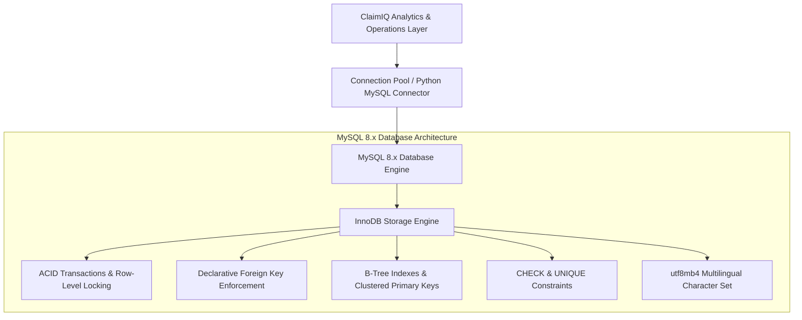
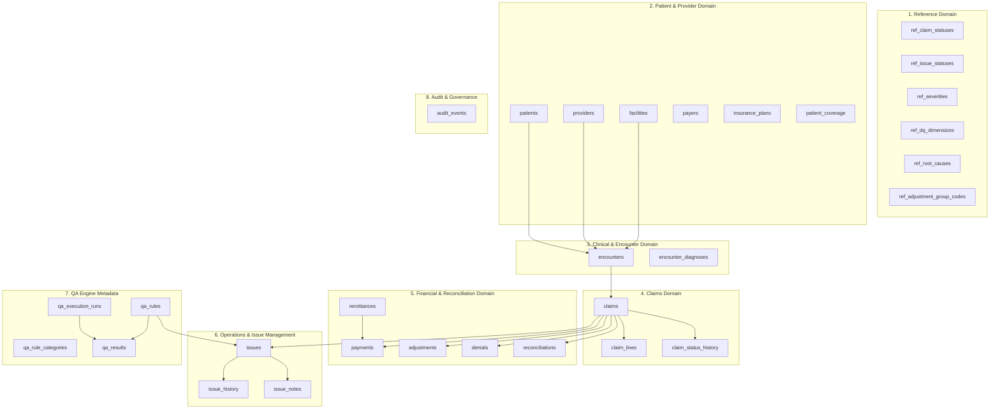

# ClaimIQ — Database Architecture & Technology Specification

## 1. Official Database Technology Decision

**MySQL 8.x** is officially selected as the relational database management system for the ClaimIQ Healthcare Claims Data Quality & Operations Platform.

---

## 2. Technical Justification for MySQL 8.x

The selection of MySQL 8.x is justified across ten foundational operational criteria:

1. **ACID Transactional Integrity & InnoDB Engine**:
   - The default **InnoDB** storage engine guarantees strict atomicity, consistency, isolation, and durability. Complex multi-table transactions (such as claim itemization, payment allocation, status changes, and audit event writes) commit or roll back atomically with zero partial state corruption.
2. **Declarative Foreign Key & Referential Integrity**:
   - InnoDB enforces standard relational foreign key constraints (`ON DELETE RESTRICT`, `ON UPDATE CASCADE`), guaranteeing that orphaned claims, lines, payments, or issues cannot be created in valid operational workflows.
3. **Exact Fixed-Point Financial Precision**:
   - MySQL 8.x natively supports `DECIMAL(12, 2)` arithmetic, guaranteeing zero floating-point representation drift during billing summation, payment allocation, adjustment calculation, and reconciliation.
4. **Microsecond Timestamp Precision & Canonical UTC Handling**:
   - MySQL 8.x provides `DATETIME(6)` with microsecond precision. ClaimIQ standardizes all temporal storage on **UTC**, eliminating daylight savings discrepancies and cross-timezone ordering bugs.
5. **Enforced CHECK Constraints**:
   - MySQL 8.0 natively enforces declarative `CHECK` constraints (e.g., `total_billed_amount >= 0.00`, `paid_amount >= 0.00`, `units > 0`), rejecting invalid negative values directly at the engine layer.
6. **High-Performance B-Tree Indexing**:
   - InnoDB utilizes clustered primary key indexes and secondary B-Tree indexes, providing sub-millisecond lookups on indexed business identifiers (`claim_reference`, `npi`, `member_id`) and status queues.
7. **Native JSON Support**:
   - MySQL 8.x provides native `JSON` column types and functions (`JSON_EXTRACT`, `JSON_OBJECT`), enabling structured storage of state diffs in immutable audit logs without sacrificing relational structure for core entities.
8. **Scalability for Synthetic Ingestion**:
   - InnoDB handles tables with millions of rows effortlessly with standard buffer pool tuning, satisfying the NFR requirement of supporting up to 1,000,000 synthetic claims.
9. **Universal Python Ecosystem Compatibility**:
   - Mature, robust Python connectors (`mysql-connector-python`, `PyMySQL`, `SQLAlchemy`) ensure seamless integration across data generation (Phase 3), analytics (Phase 6), and backend API development (Phase 7).
10. **Enterprise & Healthcare Portfolio Relevance**:
    - MySQL is one of the most widely deployed relational database engines in enterprise healthcare operations, commercial claims portals, and health tech data pipelines.

---

## 3. Technology Configuration Standards

| Architectural Standard | Specification / Value | Operational Rationale |
| :--- | :--- | :--- |
| **Database Engine** | **MySQL 8.x** (8.0.x Community Server) | Core relational engine with native CHECK constraints and JSON support. |
| **Storage Engine** | **InnoDB** | Enforces row-level locking, ACID transactions, and foreign key integrity. |
| **Character Set** | **`utf8mb4`** | Complete 4-byte Unicode encoding preventing multi-byte truncation. |
| **Default Collation** | **`utf8mb4_0900_ai_ci`** / `utf8mb4_unicode_ci` | Modern Unicode collation supporting accurate sorting and case-insensitive lookups. |
| **Timezone Standard** | **UTC (`+00:00`)** | Canonical application-wide timezone convention stored in `DATETIME(6)`. |
| **Financial Precision** | **`DECIMAL(12, 2)`** | Fixed-point exact representation up to \$9,999,999,999.99 with exact rounding. |
| **Surrogate Primary Keys** | **`BIGINT UNSIGNED AUTO_INCREMENT`** | High-performance 64-bit integer surrogate keys optimizing clustered B-Tree leaf pages. |
| **Business Identifiers** | **`VARCHAR(64) UNIQUE`** | Human-readable external references (e.g. `CLM-2026-0001`) indexed for search. |
| **SQL Mode Standard** | `STRICT_TRANS_TABLES,ERROR_FOR_DIVISION_BY_ZERO,NO_ENGINE_SUBSTITUTION` | Prevents implicit data truncation or silent coercion on invalid inserts. |

---

## 4. Architectural Domain Partitioning

The ClaimIQ schema is partitioned into nine cohesive operational domains spanning 22 normalized tables:

---

## 5. Alternatives Evaluated & Decision Matrix

| Evaluation Criteria | MySQL 8.x (Selected) | PostgreSQL (Evaluated) | SQLite (Evaluated) |
| :--- | :---: | :---: | :---: |
| **Enterprise RCM Market Adoption** | **Very High** | High | Low (Embedded Only) |
| **ACID & Referential Integrity** | **InnoDB Native** | Native | Limited (Type-Affinity) |
| **CHECK Constraint Enforcement** | **Native in 8.0+** | Native | Partial / Pragmatic |
| **Fixed-Point Financial Math** | **`DECIMAL(12, 2)`** | `NUMERIC(12, 2)` | Real / Text Affinities |
| **High-Volume Analytical Performance** | **High (B-Tree + Hash)** | High (B-Tree + BRIN) | Low for concurrent multi-client |
| **Python Ecosystem Support** | **`mysql-connector-python`** | `psycopg2 / asyncpg` | Built-in `sqlite3` |
| **Final Selection** | **SELECTED ARCHITECTURE** | Deprecated for ClaimIQ | Not suitable for enterprise simulation |
