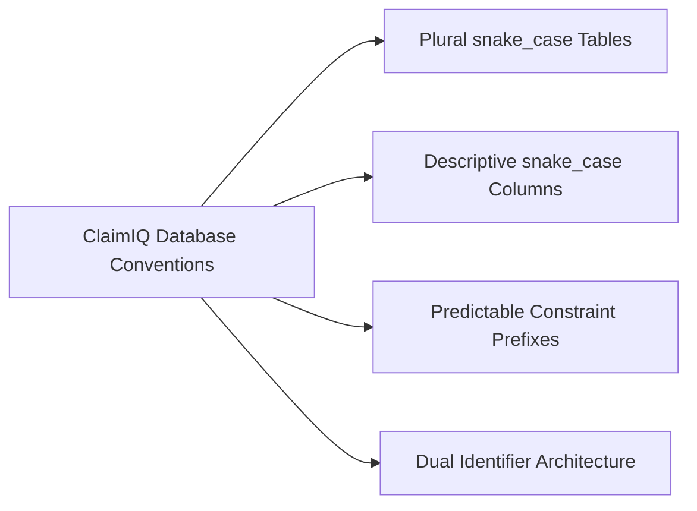
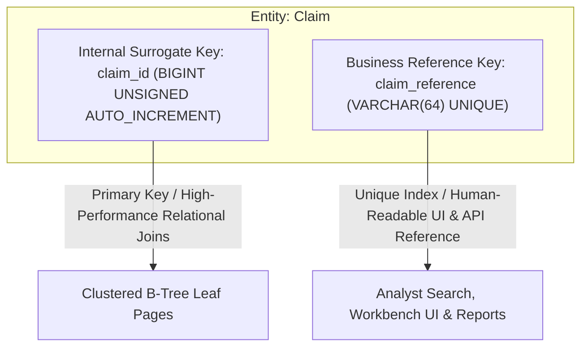

# ClaimIQ — Database Naming & Architectural Conventions

## 1. Core Design & Naming Principles

ClaimIQ enforces predictable, strict naming conventions across all MySQL 8.x schema objects to ensure maintainability, clear query authoring in Phase 5, and automated ORM mapping in Phase 7.

---

## 2. Table & Column Conventions

### 2.1 Table Naming
- **Format**: Lowercase `snake_case`, plural nouns (e.g., `patients`, `encounters`, `claims`, `claim_lines`, `issues`).
- **Reference Tables**: Prefixed with `ref_` followed by plural/category noun (e.g., `ref_claim_statuses`, `ref_severities`, `ref_root_causes`).
- **Junction / Mapping Tables**: Descriptive plural nouns expressing the relationship (e.g., `patient_coverage`, `encounter_diagnoses`).
- **History & Tracking Tables**: Suffix `_history`, `_runs`, `_results`, `_notes`, or `_events` (e.g., `claim_status_history`, `qa_execution_runs`, `audit_events`).

### 2.2 Column Naming
- **Primary Keys**: `<singular_table_name>_id` (e.g., `patient_id`, `claim_id`, `issue_id`).
- **Business Reference Identifiers**: `<singular_table_name>_reference` (e.g., `claim_reference`, `patient_reference`, `provider_reference`).
- **Foreign Keys**: Exact matching column name of referenced primary key (e.g., `claims.encounter_id` $\rightarrow$ `encounters.encounter_id`).
- **Monetary Amounts**: Suffix `_amount` or prefix `total_` with `DECIMAL(12, 2)` (e.g., `total_billed_amount`, `paid_amount`, `adjustment_amount`, `variance_amount`).
- **Dates & Timestamps**:
  - Pure Calendar Dates: Suffix `_date` with `DATE` (e.g., `date_of_service`, `date_of_birth`, `submission_date`).
  - Precise Timestamps: Suffix `_at` or `_timestamp` with `DATETIME(6)` (e.g., `created_at`, `updated_at`, `detected_at`, `resolved_at`).
- **Boolean Flags**: Prefix `is_` or `has_` with `TINYINT(1)` / `BOOLEAN` (e.g., `is_active`, `is_reconciled`, `is_primary`, `is_appealable`).
- **Status & Type Codes**: Suffix `_code` referencing standard reference tables (e.g., `current_status_code`, `severity_code`, `dimension_code`, `root_cause_code`).

---

## 3. Constraint & Index Naming Conventions

All constraints and indexes in ClaimIQ follow explicit prefix conventions to guarantee clear diagnostic messages during constraint violation errors:

| Object Type | Prefix Convention | Example Pattern | Operational Example in MySQL 8.x |
| :--- | :--- | :--- | :--- |
| **Primary Key** | `pk_` | `pk_<table_name>` | `pk_patients`, `pk_claims`, `pk_claim_lines` |
| **Foreign Key** | `fk_` | `fk_<table>_<referenced_table>` | `fk_claims_patients`, `fk_claims_encounters`, `fk_claim_lines_claims` |
| **Unique Constraint** | `uq_` | `uq_<table>_<column_name>` | `uq_claims_claim_reference`, `uq_providers_npi`, `uq_patients_reference` |
| **Check Constraint** | `chk_` | `chk_<table>_<rule_description>` | `chk_claims_billed_amt_positive`, `chk_claim_lines_units_positive` |
| **Secondary Index** | `idx_` | `idx_<table>_<column(s)>` | `idx_claims_status_date`, `idx_issues_status_severity`, `idx_encounters_dos` |

---

## 4. Identifier Architecture: Surrogate vs. Business Keys

ClaimIQ separates internal database surrogate keys from external business references across all major operational entities:

### Rationale
1. **Surrogate Keys (`BIGINT UNSIGNED AUTO_INCREMENT`)**:
   - Compact 8-byte numeric representations optimize InnoDB clustered primary key index depth and secondary index pointer size.
   - Immune to changing business reference formatting or upstream system identifier modifications.
2. **Business Reference Keys (`VARCHAR(64) UNIQUE`)**:
   - Formatted with standardized operational prefixes (e.g., `CLM-2026-00001`, `PAT-00008421`, `ISS-000491`).
   - Used for analyst search, customer-facing exports, UI routing, and API path parameters (`/api/v1/claims/CLM-2026-00001`).

---

## 5. Temporal & Timezone Standard

- **Canonical Timezone**: All timestamps are persisted in **UTC (`+00:00`)**.
- **Data Type**: **`DATETIME(6)`** with 6-digit microsecond precision.
- **Default Constraints**:
  - `created_at DATETIME(6) NOT NULL DEFAULT CURRENT_TIMESTAMP(6)`
  - `updated_at DATETIME(6) NOT NULL DEFAULT CURRENT_TIMESTAMP(6) ON UPDATE CURRENT_TIMESTAMP(6)`
- **Calendar Dates**: Pure event dates without time component use **`DATE`** (e.g., `date_of_service DATE NOT NULL`).

---

## 6. Financial Data Standards

- **Data Type**: **`DECIMAL(12, 2)`** (12 total digits, 2 fractional decimal digits).
- **Range**: $\pm \$9,999,999,999.99$.
- **Nullability**: All financial transaction amounts default to `0.00` and are strictly `NOT NULL`.
- **Integrity Rule**: Floating-point types (`FLOAT`, `DOUBLE`) are strictly prohibited for financial calculations.
