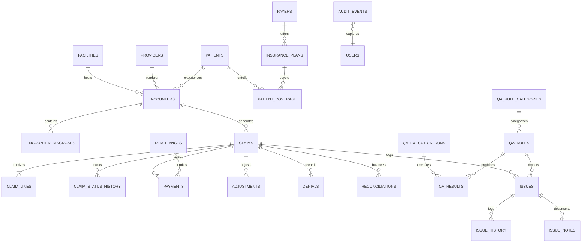
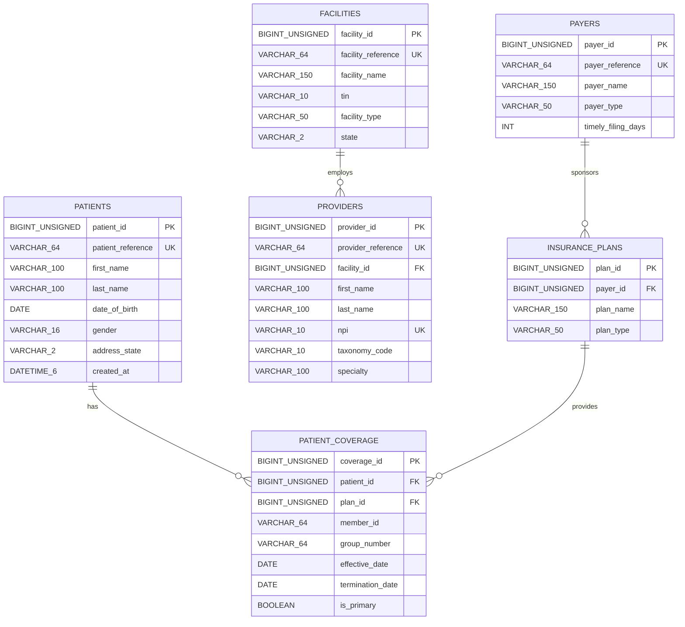
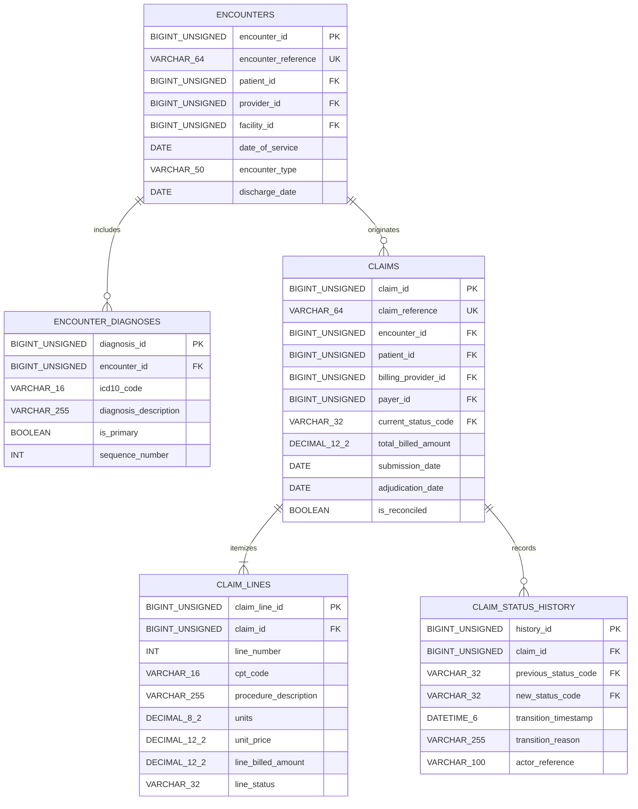
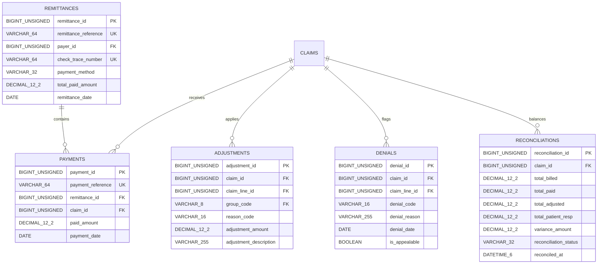
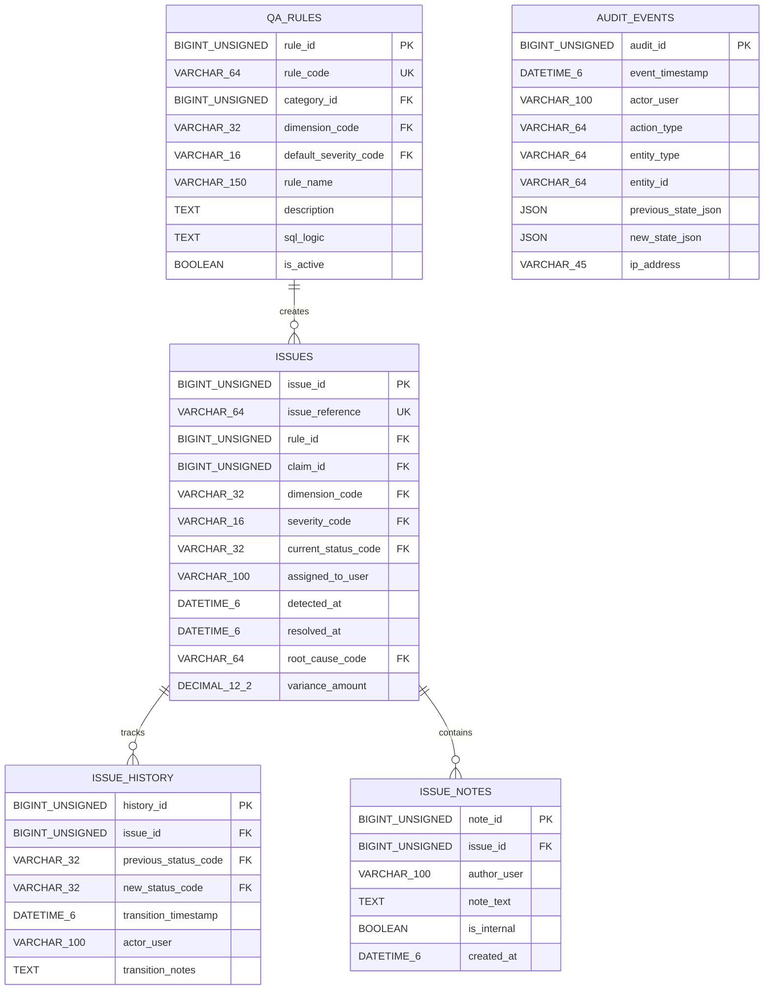

# ClaimIQ — Entity-Relationship Diagram (ERD) Specification

## 1. High-Level System ER Diagram

This diagram visualizes the primary relational connections across all nine domains of the ClaimIQ MySQL 8.x database.

---

## 2. Domain-Specific ER Diagrams

### 2.1 Patient, Provider, Facility & Insurance Coverage

---

### 2.2 Encounters, Diagnoses & Claims Itemization

---

### 2.3 Financial, Payment & Reconciliation Domain

---

### 2.4 Operations, QA Engine & Audit Domain

