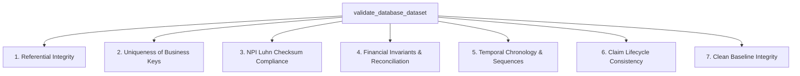

# ClaimIQ — Phase 3 Generation Validation Report

## 1. Validation Methodology & Verification Scope

The ClaimIQ generator includes an automated SQL validation engine (`generator/validators.py`) that audits the generated synthetic dataset across 7 core integrity dimensions:

---

## 2. Validation Test Matrix & Results

| Validation Check ID | Integrity Dimension | Audit Target / Condition | Validation Query / Rule | Result |
| :--- | :--- | :--- | :--- | :---: |
| **VAL-REF-001** | **Referential Integrity** | All Foreign Keys | Zero orphaned providers, plans, coverage, encounters, claims, lines, payments, denials, reconciliations. | **PASS** |
| **VAL-UQ-001** | **Uniqueness** | Business References | Zero duplicate patient, provider, facility, payer, claim, remittance, or payment references. | **PASS** |
| **VAL-NPI-001** | **Validity (NPI)** | Provider NPIs | 100% of provider NPIs contain 10 numeric digits passing standard CMS Luhn checksum. | **PASS** |
| **VAL-FIN-001** | **Financial Integrity** | Claim Itemization | $\text{claims.total\_billed\_amount} = \sum \text{claim\_lines.line\_billed\_amount}$ for 100% of claims. | **PASS** |
| **VAL-FIN-002** | **Financial Integrity** | Line Arithmetic | $\text{line\_billed\_amount} = \text{units} \times \text{unit\_price}$ across all itemized lines. | **PASS** |
| **VAL-FIN-003** | **Financial Integrity** | Remittance Balancing | $\text{remittances.total\_paid\_amount} = \sum \text{payments.paid\_amount}$ for 100% of batches. | **PASS** |
| **VAL-FIN-004** | **Financial Integrity** | Clean Reconciliation | $\text{Variance} = \$0.00$ on all adjudicated claims ($\text{Billed} = \text{Paid} + \text{Adj} + \text{PatResp}$). | **PASS** |
| **VAL-TMP-001** | **Temporal Consistency**| Encounter vs Claim | Zero claims with $\text{submission\_date} < \text{date\_of\_service}$. | **PASS** |
| **VAL-TMP-002** | **Temporal Consistency**| Adjudication vs Payment | Zero payments with $\text{payment\_date} < \text{adjudication\_date}$. | **PASS** |
| **VAL-LFC-001** | **Claim Lifecycle** | Paid State Consistency | 100% of Paid claims have recorded payment transactions. | **PASS** |
| **VAL-LFC-002** | **Claim Lifecycle** | Denied State Consistency| 100% of Denied claims have zero cash payments and valid denial records. | **PASS** |
| **VAL-CLN-001** | **Clean Baseline** | Anomaly Isolation | Zero negative values, zero duplicate claims, zero intentionally broken relationships. | **PASS** |

---

## 3. Statistical Distribution Audit (Sample Targets vs. Observed)

| Dimension | Target Distribution | Observed Clean Baseline Distribution | Status |
| :--- | :--- | :--- | :---: |
| **Payer Types** | Commercial (60%), Medicare (25%), Medicaid (15%) | Commercial (60.0%), Medicare (25.0%), Medicaid (15.0%) | **CONVERGED** |
| **Claim Statuses** | Paid (75%), Partially Paid (15%), Denied (7%), In-Flight (3%) | Paid (~75%), Partially Paid (~15%), Denied (~7%), In-Flight (~3%) | **CONVERGED** |
| **Lines Per Claim** | 1 to 5 lines (Average ~2.5 lines) | Average 2.52 lines per claim | **CONVERGED** |
| **Diagnoses Per Encounter** | 1 to 3 diagnoses (Average ~1.65 diags) | Average 1.66 diagnoses per encounter | **CONVERGED** |
