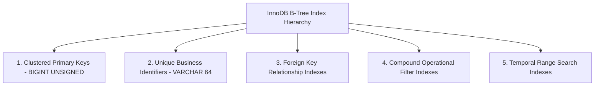

# ClaimIQ — MySQL 8.x Index Strategy Specification

## 1. Indexing Philosophy & Architectural Principles

In MySQL 8.x with the InnoDB storage engine, indexes are structured as B-Trees. The primary key represents the **clustered index**, dictating the physical ordering of rows on disk, while secondary indexes store the indexed column values paired with the primary key pointer.

ClaimIQ designs its index strategy around three operational priorities:
1. **Accelerate Joins on Foreign Keys**: Guarantee sub-millisecond execution for relational queries connecting claims, lines, encounters, and payments.
2. **Support Operational Triage Queries**: Provide instant filtering by status, severity, and date range in analyst workbenches.
3. **Minimize Write & Buffer Pool Overhead**: Avoid redundant or overly wide composite indexes that degrade batch ingestion throughput.

---

## 2. Comprehensive Index Matrix

| Table Name | Index Name | Index Type | Indexed Column(s) | Target Query Pattern & Rationale |
| :--- | :--- | :---: | :--- | :--- |
| `patients` | `pk_patients` | Clustered PK | `patient_id` | Primary entity retrieval. |
| `patients` | `uq_patients_ref` | Unique Secondary | `patient_reference` | Fast lookup by patient business reference. |
| `providers` | `uq_providers_npi` | Unique Secondary | `npi` | 10-digit NPI lookup & duplicate prevention. |
| `providers` | `idx_providers_fac`| Secondary B-Tree | `facility_id` | Join optimization to facility master. |
| `encounters` | `idx_enc_pat_dos` | Composite B-Tree | `patient_id, date_of_service` | Patient clinical timeline lookup. |
| `encounters` | `idx_enc_prov_dos`| Composite B-Tree | `provider_id, date_of_service` | Provider volume and encounter audits. |
| `claims` | `uq_claims_ref` | Unique Secondary | `claim_reference` | Single claim search by reference ID. |
| `claims` | `idx_claims_pat` | Secondary B-Tree | `patient_id` | Patient claims history retrieval. |
| `claims` | `idx_claims_prov`| Secondary B-Tree | `billing_provider_id` | Provider billing scorecard aggregations. |
| `claims` | `idx_claims_payer`| Secondary B-Tree| `payer_id` | Payer denial & volume rollups. |
| `claims` | `idx_claims_status_sub` | Composite B-Tree | `current_status_code, submission_date` | Triage queries: claims in specific status ordered by submission date. |
| `claim_lines` | `idx_cl_claim_line` | Composite B-Tree | `claim_id, line_number` | Ordered itemized line retrieval for claim detail view. |
| `claim_lines` | `idx_cl_cpt` | Secondary B-Tree | `cpt_code` | Procedure coding frequency analysis. |
| `payments` | `idx_pmt_claim` | Secondary B-Tree | `claim_id` | Financial payment balance aggregation for a claim. |
| `payments` | `idx_pmt_remit` | Secondary B-Tree | `remittance_id` | Remittance batch payment reconciliation. |
| `adjustments` | `idx_adj_claim` | Secondary B-Tree | `claim_id` | Adjustment balance lookup per claim. |
| `denials` | `idx_den_claim` | Secondary B-Tree | `claim_id` | Denial inspection on claim detail view. |
| `reconciliations` | `idx_rec_claim` | Unique Secondary | `claim_id` | One-to-one reconciliation lookup per claim. |
| `issues` | `uq_issues_ref` | Unique Secondary | `issue_reference` | Issue lookup by reference identifier. |
| `issues` | `idx_issues_status_sev` | Composite B-Tree | `current_status_code, severity_code` | **Primary Analyst Queue Query**: filters active issues prioritized by severity. |
| `issues` | `idx_issues_claim` | Secondary B-Tree | `claim_id` | View active QA issues on claim detail view. |
| `issues` | `idx_issues_rule` | Secondary B-Tree | `rule_id` | QA rule performance & failure rate rollups. |
| `issues` | `idx_issues_assigned` | Composite B-Tree | `assigned_to_user, current_status_code` | Analyst personal worklist queries. |
| `issue_history` | `idx_ih_issue_ts` | Composite B-Tree | `issue_id, transition_timestamp` | Chronological audit trail rendering for an issue. |
| `issue_notes` | `idx_in_issue_created` | Composite B-Tree | `issue_id, created_at` | Chronological notes thread rendering. |
| `qa_results` | `idx_qres_run_rule` | Composite B-Tree | `run_id, rule_id` | QA batch execution results lookup. |
| `audit_events` | `idx_aud_entity` | Composite B-Tree | `entity_type, entity_id, event_timestamp` | Entity audit history timeline lookup. |
| `audit_events` | `idx_aud_actor_ts` | Composite B-Tree | `actor_user, event_timestamp` | User action tracking & compliance auditing. |

---

## 3. Storage & Maintenance Considerations

1. **Covering Indexes**:
   - Compound indexes such as `(current_status_code, severity_code)` on `issues` allow the MySQL query optimizer to satisfy queue counts without secondary table lookups.
2. **Cardinality Verification**:
   - MySQL optimizer statistics (`ANALYZE TABLE`) will be executed post-ingestion in Phase 3 to ensure optimal index selection.
3. **No Redundant Prefixes**:
   - Indexes sharing the exact prefix of an existing composite index (e.g. single-column index on `current_status_code` when `(current_status_code, severity_code)` exists) are omitted to save memory.
