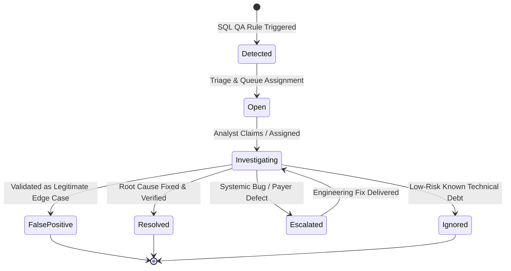
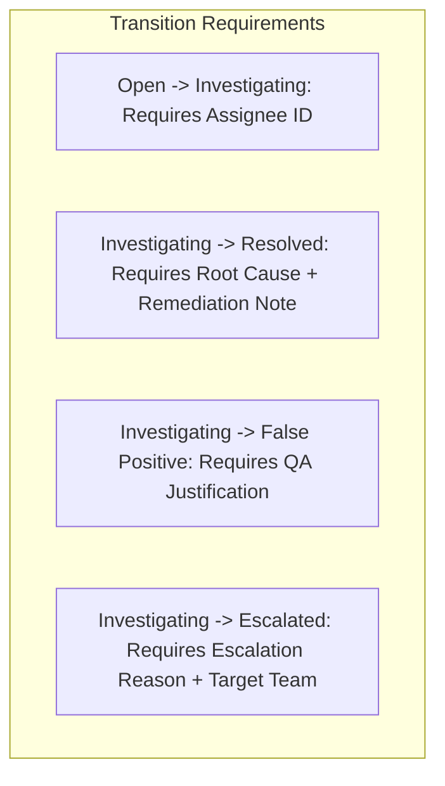

# ClaimIQ — Issue Lifecycle & State Machine Specification

## 1. Issue Management Overview

When the SQL QA engine identifies a data anomaly or business logic failure, an atomic **Issue Record** is generated. To guarantee accountability, process adherence, and operational traceability, each issue is managed through a formal Finite State Machine (FSM).

---

## 2. Issue Lifecycle States

| State | Status Name | Operational Definition & Role | Permitted Actors |
| :--- | :--- | :--- | :--- |
| **1** | **`Detected`** | The initial raw state immediately after the SQL QA engine detects a rule violation. The issue is unverified and pending triage. | System / QA Engine |
| **2** | **`Open`** | The issue has been registered in the active operational backlog and is awaiting analyst pickup or automated assignment. | Data Ops Analyst, Lead |
| **3** | **`Investigating`** | An analyst has claimed or been assigned the issue and is actively inspecting linked claims, providers, payments, and root-cause SQL queries. | Assigned Analyst |
| **4** | **`Resolved`** | The defect has been verified, the underlying root cause has been corrected or reconciled, and verification testing has passed. | Assigned Analyst, Lead |
| **5** | **`False Positive`** | The flagged record was investigated and confirmed to be a legitimate business scenario or clinical edge case. Requires QA rule tuning feedback. | QA Analyst, Ops Lead |
| **6** | **`Escalated`** | The issue represents a systemic software bug, external payer adjudication defect, or cross-functional blocker requiring management intervention. | Analyst, Ops Lead |
| **7** | **`Ignored / Suppressed`** | A minor, low-severity anomaly intentionally accepted as non-blocking or obsolete. | Operations Manager, QA Lead |

---

## 3. Transition Rules & Entry / Exit Criteria

### Transition Criteria Matrix

| Current State | Target State | Mandatory Preconditions & Entry Requirements | Data Recorded on Transition |
| :--- | :--- | :--- | :--- |
| `Detected` | `Open` | Batch run completes; severity and category indexed. | `opened_at` timestamp; placed into triage queue. |
| `Open` | `Investigating` | Must assign a valid active user ID (`assigned_to_user_id`). | `assigned_at` timestamp; status changed; audit log entry. |
| `Investigating` | `Resolved` | Mandatory selection of **Root Cause Category** and descriptive **Remediation Notes** ($\ge 20$ characters). | `resolved_at`, `root_cause_category`, `resolution_notes`, `resolved_by_user_id`. |
| `Investigating` | `False Positive` | Mandatory **QA Justification Note** explaining why the rule triggered erroneously. | `resolved_at`, `false_positive_reason`, flag for QA rule tuning. |
| `Investigating` | `Escalated` | Mandatory **Escalation Reason** and target escalation group (`Engineering`, `Payer Relations`, `Billing Operations`). | `escalated_at`, `escalated_to_team`, `escalation_notes`. |
| `Escalated` | `Investigating` | Upstream team delivers fix; returned to analyst for verification. | `reopened_at`, updated investigation notes thread. |
| `Investigating` | `Ignored` | Only permissible for `Low` severity; requires Manager approval. | `suppressed_at`, `suppression_rationale`, manager user ID. |

---

## 4. Standard Root-Cause Categories

When resolving an issue, analysts must select one of the standardized root-cause taxonomy categories:

1. **`DATA_ENTRY_ERROR`**: Typo or formatting mistake introduced during manual charge capture or patient intake.
2. **`SYSTEM_CONFIG_ERROR`**: Upstream billing software or EHR configuration mismatch (e.g., outdated taxonomy code mapping).
3. **`PAYER_ADJUDICATION_DEFECT`**: The health plan adjudicated the claim incorrectly according to contractual fee schedules.
4. **`TIMING_DESYNCHRONIZATION`**: Race condition where payment or denial transaction arrived out of chronological order.
5. **`DUPLICATE_SUBMISSION`**: Resubmission of an already submitted claim without a void/replacement frequency code.
6. **`REFERENTIAL_MISSING_MASTER`**: Upstream feed failed to sync a new provider or facility master record prior to claim transmission.
7. **`CALCULATION_ROUNDING_DEFECT`**: Minor fractional cent rounding discrepancy between itemized lines and total balance.

---

## 5. Audit Logging & State History

Every state transition generates an immutable record in the `audit_log` repository:
- `audit_id`: Unique sequence ID.
- `timestamp`: UTC timestamp of the transition.
- `actor_id`: User ID executing the state change.
- `entity_type`: `'ISSUE'`.
- `entity_id`: Target `issue_id`.
- `old_state`: Previous status string.
- `new_state`: Updated status string.
- `change_summary`: JSON object containing updated fields (`assigned_to`, `root_cause_category`, `notes`).
