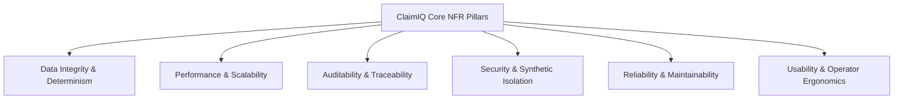

# ClaimIQ — Non-Functional Requirements Specification

## 1. Overview & Architectural Quality Attributes

Non-Functional Requirements (NFRs) define the operational qualities, architectural constraints, security benchmarks, and performance criteria that ClaimIQ must fulfill. Given ClaimIQ's focus on healthcare data operations and quality assurance, special emphasis is placed on **Data Integrity**, **Traceability**, **Reproducibility**, and **Auditability**.

---

## 2. Detailed Non-Functional Requirements

### 2.1 Data Integrity & Determinism

- **NFR-DI-001 (Deterministic Validation)**: The SQL QA engine must execute deterministically. Given the identical dataset and rule parameters, consecutive executions must produce identical issue counts, severity classifications, and DQ scores with 100% mathematical consistency.
- **NFR-DI-002 (Atomic Transactions)**: All batch validations, issue status updates, and audit logging must occur within ACID-compliant database transactions to prevent partial updates or orphaned state records.
- **NFR-DI-003 (Financial Precision)**: All monetary calculations (billed, paid, adjustment, patient responsibility amounts) must use exact fixed-point numeric data types (`NUMERIC(12, 2)` or `DECIMAL(12, 2)`) to eliminate floating-point rounding errors.
- **NFR-DI-004 (Referential Consistency)**: Relational schema must enforce foreign key integrity where appropriate, while allowing intentionally injected synthetic anomalies to be quarantined and investigated without crashing upstream pipelines.

---

### 2.2 Performance & Scalability

- **NFR-PRF-001 (QA Batch Execution Latency)**: The SQL QA engine must evaluate a batch of 100,000 synthetic claims across all active validation rules in under **30 seconds** on standard server hardware.
- **NFR-PRF-002 (Dashboard Query Latency)**: Dashboard summary views, overall DQ scorecards, and high-level charts must render with a 95th-percentile ($p95$) response latency of under **200 milliseconds**.
- **NFR-PRF-003 (Search & Filter Response)**: Parameterized queries across claims and issues with multiple filter predicates (e.g., date range + severity + status) must return paginated results within **300 milliseconds** for datasets up to 1,000,000 records.
- **NFR-PRF-004 (Dataset Scalability)**: The platform architecture must support relational storage and querying of up to **1,000,000 synthetic claim records** and associated transaction lines without degradation in query execution plans.
- **NFR-PRF-005 (Concurrent Analyst Workloads)**: The backend API and database must support at least **25 concurrent operational analysts** performing active investigations, filter queries, and status updates with zero lock contention or connection exhaustion.

---

### 2.3 Auditability & Traceability

- **NFR-AUD-001 (Immutable Event Logging)**: The audit logging subsystem must implement append-only constraints. Historical audit records cannot be edited, deleted, or truncated by any user or application role.
- **NFR-AUD-002 (Complete Provenance)**: Every data modification (issue status update, assignee change, rule configuration edit) must record the exact actor identifier, timestamp (ISO-8601 UTC), previous value, new value, and client session metadata.
- **NFR-AUD-003 (Rule Execution Lineage)**: Every detected issue must store the exact `rule_id`, rule version number, execution batch ID, and the raw SQL query snapshot executed at the time of detection.
- **NFR-AUD-004 (Audit Retention)**: The system must retain 100% of audit event records for the full operational lifecycle of the dataset.

---

### 2.4 Security & Synthetic Isolation

- **NFR-SEC-001 (Zero PHI Mandate)**: The platform must strictly enforce synthetic data isolation. No real patient names, Social Security Numbers, actual medical record numbers (MRNs), or live insurance policy IDs may be ingested or processed.
- **NFR-SEC-002 (Role-Based Access Enforcement)**: All backend endpoints and user actions must validate authorization tokens against the Role-Based Access Control (RBAC) matrix before executing data queries or state mutations.
- **NFR-SEC-003 (Input Sanitization & SQL Injection Prevention)**: All SQL queries executed by the application or QA engine must use parameterized statements or validated ORM constructs to prevent SQL injection vulnerabilities.
- **NFR-SEC-004 (Secure Credential Storage)**: User passwords and authentication secrets must be hashed using industry-standard cryptographic algorithms (e.g., bcrypt with minimum work factor 12 or Argon2id).

---

### 2.5 Reliability, Availability & Fault Tolerance

- **NFR-REL-001 (Pipeline Fault Isolation)**: A failure in an individual QA rule (e.g., syntax error or division by zero in a newly authored rule) must be isolated, logged as an error, and must not terminate the overall batch execution of remaining rules.
- **NFR-REL-002 (Data Recovery & Backup)**: The database schema and seed data generation scripts must be completely reproducible from code repository definitions within under **5 minutes**.
- **NFR-REL-003 (Service Uptime)**: The web dashboard and API services must maintain 99.9% availability during scheduled operational testing windows.

---

### 2.6 Maintainability & Code Quality

- **NFR-MNT-001 (Modular Rule Architecture)**: All QA rules must be defined as modular, independent SQL components or configuration files with standard metadata headers, allowing easy addition or deprecation without refactoring the engine.
- **NFR-MNT-002 (Database Migrations)**: All database schema definitions and revisions must be managed via version-controlled migration scripts (e.g., Alembic / Flyway).
- **NFR-MNT-003 (Codebase Cleanliness)**: All backend code must adhere to PEP-8 (Python) and frontend code to ESLint / Prettier standards with zero critical lint errors.

---

### 2.7 Usability & Operator Ergonomics

- **NFR-USE-001 (Cognitive Load Reduction)**: The user interface must present critical information hierarchies clearly, using standard color coding (Red = Critical, Orange = High, Yellow = Medium, Blue = Low) to prioritize urgent tasks.
- **NFR-USE-002 (Investigation Efficiency)**: An analyst must be able to navigate from an aggregate dashboard alert to the full claim detail and root-cause SQL query in **3 or fewer clicks**.
- **NFR-USE-003 (Accessible UI Standards)**: The web interface must maintain high contrast ratios (WCAG 2.1 AA compliant) and provide responsive layouts suitable for standard desktop workstation resolutions (1920x1080 and 1440x900).

---

### 2.8 Documentation Quality & Reproducibility

- **NFR-DOC-001 (Comprehensive SOP Coverage)**: Every data quality rule must be accompanied by a human-readable Standard Operating Procedure (SOP) explaining the business logic, root cause scenarios, and resolution guidelines.
- **NFR-DOC-002 (System Architecture Completeness)**: Architecture diagrams, entity relationship diagrams (ERDs), and state machine specifications must remain fully synchronized with implemented code across all development phases.
