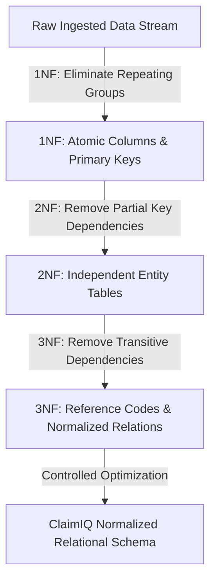

# ClaimIQ — Normalization Strategy & 3NF Architectural Review

## 1. Normalization Objectives & Philosophy

The ClaimIQ database is engineered to achieve **Third Normal Form (3NF)** across all transactional, clinical, financial, and operational entities.

The primary goals of this normalization design are:
1. **Eliminate Data Redundancy**: Prevent duplicate storage of patient demographics, provider credentials, and facility attributes across millions of claims.
2. **Prevent Modification Anomalies**: Eliminate insertion, update, and deletion anomalies during daily operational workflows.
3. **Preserve Relational Integrity**: Guarantee that itemized service lines, payments, adjustments, and issues maintain strict dependency on their parent headers.
4. **Isolate Historical Snapshots**: Explicitly decouple mutable master entities from immutable audit logs and historical status transitions.

---

## 2. Progressive Normalization Analysis

### 2.1 First Normal Form (1NF) Compliance
- **Requirement**: Every attribute must be atomic (no repeating groups, comma-separated lists, or embedded arrays); every table must possess a primary key.
- **ClaimIQ Implementation**:
  - Itemized procedures are never stored as delimited strings within `claims`; they are normalized into the `claim_lines` table where each row represents a single billable CPT/HCPCS unit.
  - Multi-diagnosis encounters are normalized into `encounter_diagnoses` with an explicit sequence number and `is_primary` flag.
  - Multi-payer coverage policies are normalized into `patient_coverage` with explicit ranking flags (`is_primary`).

### 2.2 Second Normal Form (2NF) Compliance
- **Requirement**: The schema must be in 1NF, and all non-key attributes must depend on the *entire* primary key (no partial functional dependencies on composite keys).
- **ClaimIQ Implementation**:
  - Surrogate primary keys (`BIGINT UNSIGNED AUTO_INCREMENT`) are established for all transaction tables (`claim_lines`, `encounter_diagnoses`, `payments`, `adjustments`), eliminating composite key partial dependencies.
  - In `claim_lines`, attributes such as `unit_price`, `units`, and `line_billed_amount` depend fully on `claim_line_id`.
  - In `payments`, attributes such as `paid_amount` and `payment_date` depend fully on `payment_id`.

### 2.3 Third Normal Form (3NF) Compliance
- **Requirement**: The schema must be in 2NF, and all non-key attributes must depend *only* on candidate keys (no transitive functional dependencies: $X \rightarrow Y \rightarrow Z$).
- **ClaimIQ Implementation**:
  - `claims` table stores `encounter_id`, `patient_id`, `billing_provider_id`, and `payer_id`. Provider attributes (such as `npi`, `taxonomy_code`, `specialty`) are stored exclusively in `providers`.
  - `encounters` table stores `facility_id`; facility address and tax ID (TIN) are stored exclusively in `facilities`.
  - Payer timely filing rules and plan names are stored exclusively in `payers` and `insurance_plans`.

---

## 3. Functional Dependency Map

The table below outlines core functional dependencies across key entities:

| Table | Determinant (Primary / Candidate Key) | Functionally Determined Non-Key Attributes |
| :--- | :--- | :--- |
| `patients` | `patient_id` | `patient_reference`, `first_name`, `last_name`, `date_of_birth`, `gender`, `address_state`, `created_at` |
| `providers` | `provider_id` | `provider_reference`, `facility_id`, `first_name`, `last_name`, `npi`, `taxonomy_code`, `specialty` |
| `facilities` | `facility_id` | `facility_reference`, `facility_name`, `tin`, `facility_type`, `state` |
| `payers` | `payer_id` | `payer_reference`, `payer_name`, `payer_type`, `timely_filing_days` |
| `encounters` | `encounter_id` | `encounter_reference`, `patient_id`, `provider_id`, `facility_id`, `date_of_service`, `encounter_type` |
| `claims` | `claim_id` | `claim_reference`, `encounter_id`, `patient_id`, `billing_provider_id`, `payer_id`, `current_status_code`, `total_billed_amount`, `submission_date` |
| `claim_lines` | `claim_line_id` | `claim_id`, `line_number`, `cpt_code`, `procedure_description`, `units`, `unit_price`, `line_billed_amount` |
| `payments` | `payment_id` | `payment_reference`, `remittance_id`, `claim_id`, `paid_amount`, `payment_date` |
| `issues` | `issue_id` | `issue_reference`, `rule_id`, `claim_id`, `dimension_code`, `severity_code`, `current_status_code`, `assigned_to_user`, `detected_at` |

---

## 4. Analysis of Modification Anomalies

| Anomaly Type | Classic Denormalized Risk | ClaimIQ 3NF Prevention Mechanism |
| :--- | :--- | :--- |
| **Insertion Anomaly** | Cannot register a new Provider without immediately having an associated claim. | `providers` table exists independently; clinicians can be credentialed and enrolled before any encounter occurs. |
| **Update Anomaly** | Updating a provider's NPI requires updating 50,000 historical claim records. | Provider NPI is updated in a single row in `providers`; all linked claims reference `provider_id`. |
| **Deletion Anomaly** | Purging an erroneous claim accidentally deletes the patient's master record. | `patients` and `claims` are independent entities connected via `ON DELETE RESTRICT` foreign keys. |

---

## 5. Documented Intentional Denormalization / Summary Structures

In high-volume healthcare data operations, selective controlled denormalization is permissible when strictly governed. ClaimIQ documents three intentional architectural design choices:

1. **`claims.total_billed_amount` vs. `claim_lines.line_billed_amount`**:
   - **Reasoning**: The claim header stores `total_billed_amount` directly. While mathematically this represents $\sum \text{line\_billed\_amount}$, storing the header amount is mandatory because in EDI 837 transactions, the header charge is independently submitted. This allows Phase 5 QA rules (`RULE-FIN-005`) to test for arithmetic desynchronization between header and line sums.
2. **`claims.patient_id` and `claims.payer_id` (Redundant with `encounters`)**:
   - **Reasoning**: While `claims.encounter_id` links to `encounters`, storing `patient_id` and `payer_id` on the claim header mirrors standard 837 claim structures and allows high-throughput querying and filtering without mandatory 3-table joins.
3. **`reconciliations` Snapshot Table**:
   - **Reasoning**: Stores calculated financial balance snapshots (`total_billed`, `total_paid`, `total_adjusted`, `variance_amount`) at the time of reconciliation verification to provide immutable financial point-in-time auditability.
