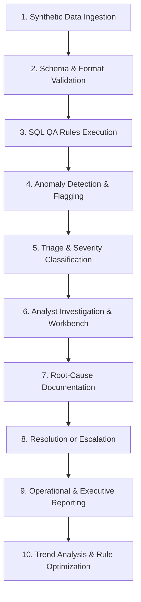

# ClaimIQ — Operational Workflow & Standard Operating Procedure (SOP)

## 1. End-to-End Operational Lifecycle

The ClaimIQ platform supports a standardized 10-step daily operational lifecycle for healthcare data quality assurance, issue investigation, resolution tracking, and executive reporting.

---

## 2. The 10 Operational Stages

### Stage 1: Data Ingestion
- **Description**: Synthetic claims, encounters, payments, providers, and patient records are loaded into the database staging area.
- **Trigger**: Daily scheduled batch (e.g., 04:00 UTC) or ad-hoc data pipeline run.
- **Actor**: System Administrator / Automated Pipeline.

### Stage 2: Schema & Format Validation
- **Description**: Ingested datasets undergo initial structural checks (data types, mandatory non-null constraints, primary key uniqueness).
- **Actor**: System Ingestion Pipeline.

### Stage 3: SQL QA Rules Execution
- **Description**: The SQL QA Engine executes the active suite of data quality validation queries across the 7 DQ dimensions.
- **Actor**: SQL QA Engine / QA Analyst.

### Stage 4: Anomaly Detection & Flagging
- **Description**: Records failing any QA rule criteria are isolated; exact failing values, foreign key mismatches, or mathematical variances are compiled into anomaly packets.
- **Actor**: Automated Engine.

### Stage 5: Triage & Severity Classification
- **Description**: Detected anomalies are transformed into atomic `Issue` records. Severity ratings (`Critical`, `High`, `Medium`, `Low`) and default routing queues are assigned.
- **Actor**: Issue Engine / Operations Lead.

### Stage 6: Analyst Investigation & Workbench
- **Description**: Data Operations Analysts open the Issue Investigation Workbench, examine the affected claim header, itemized claim lines, linked payments, and review the failed SQL query logic.
- **Actor**: Data Operations Analyst.

### Stage 7: Root-Cause Documentation
- **Description**: The analyst identifies the failure mechanism, documents detailed investigation notes, selects a standardized root-cause taxonomy tag, and reviews SOP remediation steps.
- **Actor**: Data Operations Analyst.

### Stage 8: Resolution or Escalation
- **Description**: The analyst reconciles the data discrepancy, flags false positives for rule tuning, or escalates systemic software/payer bugs to leadership.
- **Actor**: Data Operations Analyst / Operations Manager.

### Stage 9: Operational & Executive Reporting
- **Description**: Automated aggregation jobs compile daily data quality scorecards, provider error distributions, payer adjudication summaries, and resolution SLA metrics.
- **Actor**: Reporting Engine / Operations Manager.

### Stage 10: Trend Monitoring & Continuous Improvement
- **Description**: Leadership and QA teams analyze 30-day error trends, recurring provider billing defects, and calibrate QA rules to prevent future pipeline failures.
- **Actor**: QA Analyst / Operations Manager.

---

## 3. Daily & Weekly Operational Cadence

```mermaid
gantt
    title Daily Data Operations Operational Schedule
    dateFormat  HH:mm
    axisFormat  %H:%M
    section Overnight
    Batch Data Ingestion & SQL QA Run   :04:00, 2h
    section Morning Shift
    Triage Critical & High Severity Issues :08:00, 1h30m
    Daily Operations Standup & Queue Allocation :09:30, 30m
    Active Issue Investigation & Root Cause Notes :10:00, 3h
    section Afternoon Shift
    Escalation Review & Payer Discrepancy Checks :14:00, 1h30m
    Reconciliation & Resolution Verification :15:30, 1h30m
    Daily Quality Report Generation & EOD Sign-off :17:00, 30m
```

### Daily Cadence Checklist
- **08:00 - 09:30**: **Critical Triage**. Review overnight batch run, inspect any `Critical` financial or referential anomalies, verify SLA countdown timers.
- **09:30 - 10:00**: **Queue Allocation**. Assign unassigned `High` and `Medium` severity issues across the data operations team.
- **10:00 - 15:30**: **Active Investigation**. Utilize the workbench, execute targeted queries, log root-cause findings, resolve verified records.
- **15:30 - 17:00**: **Reconciliation & Reporting**. Audit reconciled accounts, verify zero unresolved critical balances, publish Daily Data Quality Report.

### Weekly Cadence Checklist
- **Monday Morning**: Review weekly backlog aging and queue velocity metrics.
- **Wednesday Afternoon**: QA Rule Calibration meeting (review all issues flagged as `False Positive` to refine SQL query thresholds).
- **Friday Afternoon**: Generate Weekly Operations Summary, review Provider Quality Scorecards, and archive weekly audit logs.
