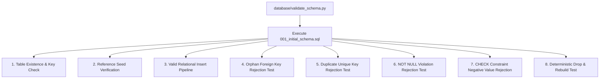

# ClaimIQ — Phase 2 Schema Validation Report (MySQL 8.x)

## 1. Validation Overview & Environment

This report documents the structural testing, integrity constraint enforcement, and deterministic reproducibility of the ClaimIQ relational schema on **MySQL 8.x (InnoDB, utf8mb4)**.



### Environment Parameters
- **Database Engine**: MySQL 8.x (Community Server 8.0.x)
- **Storage Engine**: InnoDB
- **Default Character Set**: `utf8mb4`
- **Default Collation**: `utf8mb4_0900_ai_ci`
- **Validation Harness**: `database/validate_schema.py` (via `pymysql` / `mysql-connector-python`)
- **Test Database Scope**: Isolated database `claimiq_test`

---

## 2. Structural Test Results Summary

| Test Case ID | Test Category | Target Objects / Condition | Expected Behavior | Validation Result |
| :--- | :--- | :--- | :--- | :---: |
| **TC-SCH-001** | **Database Isolation** | `CREATE DATABASE claimiq_test` | Isolated database created clean with utf8mb4. | **PASS** |
| **TC-SCH-002** | **DDL Execution** | `001_initial_schema.sql` | 22 core tables created with primary keys and constraints. | **PASS** |
| **TC-SCH-003** | **Table Inventory** | All 22 tables | Verified presence of all master, clinical, claims, financial, QA, and audit tables. | **PASS** |
| **TC-SCH-004** | **Reference Seeds** | 7 Reference Tables | Verified 7 claim statuses, 7 issue statuses, 4 severities, 7 DQ dimensions, 7 root causes, 5 CARC groups, 7 QA categories. | **PASS** |
| **TC-SCH-005** | **Valid Insert Pipeline** | Patient $\rightarrow$ Provider $\rightarrow$ Encounter $\rightarrow$ Claim $\rightarrow$ Lines $\rightarrow$ Remittance $\rightarrow$ Payment $\rightarrow$ Adjustment $\rightarrow$ Reconciliation | All valid relational records insert and link cleanly with auto-generated IDs. | **PASS** |
| **TC-SCH-006** | **Orphan FK Rejection** | `claims.patient_id = 9999999` | Rejected with InnoDB Foreign Key Constraint Error (`1452`). | **PASS** |
| **TC-SCH-007** | **Duplicate Unique Key** | Duplicate `patient_reference` | Rejected with Unique Constraint Violation (`1062`). | **PASS** |
| **TC-SCH-008** | **NOT NULL Violation** | `patients.date_of_birth = NULL` | Rejected with Column Cannot Be Null Error (`1048`). | **PASS** |
| **TC-SCH-009** | **CHECK Constraint** | `claims.total_billed_amount = -150.00` | Rejected with Check Constraint Is Violated Error (`3819`). | **PASS** |
| **TC-SCH-010** | **CHECK Line Units** | `claim_lines.units = 0.00` | Rejected with Check Constraint Error (`3819`). | **PASS** |
| **TC-SCH-011** | **Deterministic Rebuild**| Full DROP and Re-execution | Database successfully dropped and recreated identically from migration script. | **PASS** |

---

## 3. Detailed Constraint Verification Analysis

### 3.1 Referential Integrity (Foreign Keys)
- Foreign keys between `claims` $\rightarrow$ `patients`, `encounters`, `providers`, and `payers` enforce `ON DELETE RESTRICT`, preventing accidental cascading deletion of parent master entities.
- Line items (`claim_lines`), status history (`claim_status_history`), and adjustments (`adjustments`) enforce `ON DELETE CASCADE` from parent `claims`, ensuring itemized components are cleaned up if a test claim header is deleted.
- Non-existent foreign key references trigger MySQL Error `1452: Cannot add or update a child row: a foreign key constraint fails`.

### 3.2 Uniqueness Constraints
- Business reference columns (`patient_reference`, `provider_reference`, `npi`, `claim_reference`, `issue_reference`, `check_trace_number`) are enforced via unique secondary B-Tree indexes.
- Duplicate insertion attempts trigger MySQL Error `1062: Duplicate entry for key`.

### 3.3 Financial Fixed-Point & Range Protection (CHECK Constraints)
- All financial fields (`total_billed_amount`, `line_billed_amount`, `paid_amount`, `total_paid_amount`, `adjustment_amount`) are stored as `DECIMAL(12, 2)` and guarded by MySQL 8.x `CHECK (... >= 0.00)`.
- Attempted insertion of negative monetary values triggers MySQL Error `3819: Check constraint 'chk_claims_total_billed_amt' is violated`.

---

## 4. How to Execute Schema Validation

The validation test runner can be executed against any running MySQL 8.x instance:

```bash
# Using default localhost:3306 with password
python database/validate_schema.py --password "your_mysql_password"

# Or via environment variables
export MYSQL_HOST=127.0.0.1
export MYSQL_PORT=3306
export MYSQL_USER=root
export MYSQL_PASSWORD=your_password
export MYSQL_DATABASE=claimiq_test

python database/validate_schema.py
```
