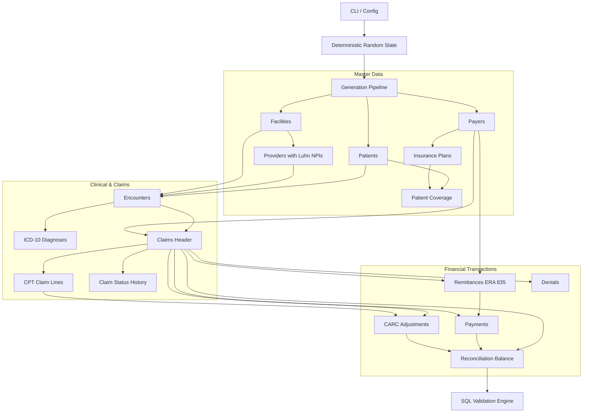

# ClaimIQ — Phase 3 Data Generation Engine

## 1. Executive Summary & Purpose

Phase 3 implements the **Synthetic Healthcare Claims Data Generation Engine** for the ClaimIQ platform. Its primary objective is to populate the Phase 2 normalized MySQL 8.x relational schema with a completely clean, mathematically balanced, referentially valid baseline dataset.



---

## 2. Core Architecture & Modules

The generator is designed as a modular Python package located in `generator/`:

| Module | Location | Purpose |
| :--- | :--- | :--- |
| **CLI & Orchestrator** | `generator/cli.py` | Command-line interface and 17-step topological pipeline runner. |
| **Configuration** | `generator/config.py` | Sizing profiles (`small`, `medium`, `large`), date bounds, and DB connection options. |
| **Random State** | `generator/random_state.py` | Encapsulated deterministic pseudo-random state (`random.Random` + `Faker`). |
| **Identifier Engine** | `generator/identifiers.py` | Structured business references (`PAT-`, `CLM-`, `REM-`, `PMT-`) and NPI Luhn checksum. |
| **Temporal Engine** | `generator/dates.py` | Chronological date sequence generator enforcing temporal validity. |
| **Financial Engine** | `generator/financials.py` | Python `Decimal` fixed-point math ensuring zero reconciliation variance. |
| **Distributions** | `generator/distributions.py` | Statistical categorical distribution samplers for payers, statuses, and lines. |
| **Database Manager** | `generator/database.py` | Connection pooling, chunked batch inserts (`executemany`), and safe reset engine. |
| **Reference Validator**| `generator/reference_data.py` | Pre-execution validation of static reference seed tables. |
| **Validation Engine** | `generator/validators.py` | Automated SQL audit engine verifying 7 integrity dimensions against MySQL. |

---

## 3. Topologically Ordered Generation Order

To strictly satisfy MySQL 8.x InnoDB foreign key constraints with `FOREIGN_KEY_CHECKS = 1`:

1. **Static Reference Verification** (`ref_claim_statuses`, `ref_severities`, `ref_dq_dimensions`, `ref_adjustment_group_codes`)
2. **`facilities`** (Independent healthcare organizations)
3. **`payers`** (Commercial, Medicare, Medicaid insurance companies)
4. **`insurance_plans`** (Benefit plan products under payers)
5. **`providers`** (Clinicians associated with facilities with 10-digit Luhn NPIs)
6. **`patients`** (Synthetic patient demographics, 18–85 years old)
7. **`patient_coverage`** (Patient policy enrollment linking patients to plans)
8. **`encounters`** (Clinical care delivery episodes)
9. **`encounter_diagnoses`** (Itemized ICD-10 diagnostic coding)
10. **`claims`** (Billing claim headers)
11. **`claim_lines`** (Itemized procedural CPT lines with `units * unit_price = line_billed`)
12. **`claim_status_history`** (State transition history representing complete claim lifecycle)
13. **`remittances`** (Electronic Remittance Advice ERA 835 batch headers)
14. **`payments`** (Disbursed cash allocations linking remittances to claims)
15. **`adjustments`** (Contractual `CO-45` write-offs and `PR-1` patient copays)
16. **`denials`** (Formal denial determinations with valid CARC codes)
17. **`reconciliations`** (Mathematical balance ledger verifying $\text{Variance} = \$0.00$)

---

## 4. CLI Usage & Commands

```bash
# Display CLI help and options
python -m generator --help

# Generate Small dataset with deterministic seed 42
python -m generator --scale small --seed 42 --db-host 127.0.0.1 --db-name claimiq_test

# Dry-run simulation (verifies configuration without writing to MySQL)
python -m generator --scale small --seed 42 --dry-run

# Run full SQL data quality validation suite on current database
python -m generator --validate

# Safely reset and delete synthetic transactional/master data (preserves schema & references)
python -m generator --reset
```
