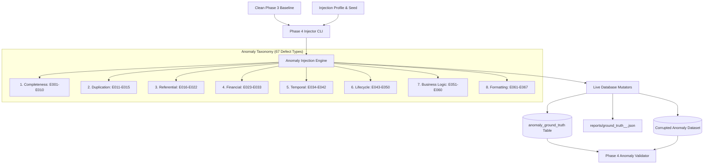

# ClaimIQ — Phase 4 Controlled Error Injection Engine

## 1. Executive Summary & Purpose

Phase 4 implements the **Controlled Error Injection & Anomaly Dataset Engineering Engine** for the ClaimIQ platform. Its primary objective is to take clean Phase 3 synthetic healthcare baseline datasets and introduce controlled, realistic, traceable defects to prepare benchmark datasets for Phase 5 QA rule execution.



---

## 2. Core Architecture & Modules

The error injection framework is organized within `generator/injector/`:

| Module | File Path | Purpose |
| :--- | :--- | :--- |
| **CLI Runner** | [`generator/injector/cli.py`](file:///D:/Projects/ClaimIQ/generator/injector/cli.py) | CLI interface for `--profile`, `--seed`, `--dry-run`, `--validate`, `--report`, and `--reset-anomalies`. |
| **Direct Entrypoint** | [`generator/inject.py`](file:///D:/Projects/ClaimIQ/generator/inject.py) | Root runner alias for `python -m generator.inject`. |
| **Core Models** | [`generator/injector/models.py`](file:///D:/Projects/ClaimIQ/generator/injector/models.py) | Dataclasses for `AnomalyDefinition`, `GroundTruthRecord`, `SeverityLevel`, `AnomalyCategory`. |
| **Taxonomy Registry**| [`generator/injector/taxonomy.py`](file:///D:/Projects/ClaimIQ/generator/injector/taxonomy.py) | Registry of all 67 anomaly definitions (`E001`–`E067`) with complete metadata. |
| **Profiles Config** | [`generator/injector/profiles.py`](file:///D:/Projects/ClaimIQ/generator/injector/profiles.py) | Profile definitions (`clean`, `light`, `moderate`, `heavy`, `targeted`). |
| **Injection Engine** | [`generator/injector/engine.py`](file:///D:/Projects/ClaimIQ/generator/injector/engine.py) | Target selection, mutation execution, dry-run simulation, and transaction management. |
| **Ground Truth Mgr** | [`generator/injector/ground_truth.py`](file:///D:/Projects/ClaimIQ/generator/injector/ground_truth.py) | Persistence to MySQL `anomaly_ground_truth`, JSON export, and two-way mutation reversion. |
| **Validation Engine**| [`generator/injector/validators.py`](file:///D:/Projects/ClaimIQ/generator/injector/validators.py) | Automated audit verifying expected mutations against live MySQL state. |
| **Mutator Modules** | [`generator/injector/mutators/`](file:///D:/Projects/ClaimIQ/generator/injector/mutators/) | 8 category-specific mutation modules executing targeted data changes. |

---

## 3. CLI Usage & Commands

```bash
# List all 67 registered anomaly definitions
python -m generator.inject --list-taxonomy

# Dry-run simulation (verifies planned mutations without modifying database)
python -m generator.inject --profile moderate --seed 42 --dry-run

# Execute Moderate profile injection against live database
python -m generator.inject --profile moderate --seed 42

# Execute Targeted injection for specific financial and temporal anomalies
python -m generator.inject --profile targeted --anomaly E023,E030,E034 --count 5 --seed 42

# Validate live database mutations against active ground truth
python -m generator.inject --validate

# View report of active ground truth records
python -m generator.inject --report

# Revert all active injected anomalies to restore clean baseline
python -m generator.inject --reset-anomalies

# Full database purge (all synthetic data + ground truth)
python -m generator.inject --reset
```
