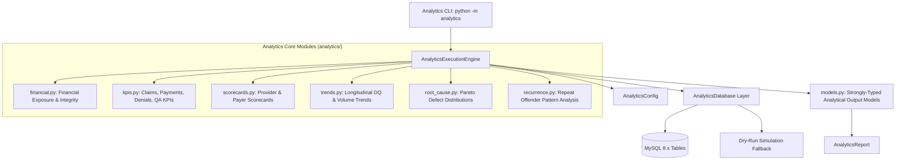

# Phase 6 — Python Analytics Engine & Advanced Data Quality Analytics

## Executive Summary
Phase 6 of ClaimIQ introduces a deterministic, read-only Python analytical calculation subsystem. Sitting directly on top of the MySQL 8.x claims schema, Phase 3 synthetic baseline, Phase 4 error injection framework, and Phase 5 QA rule telemetry, Phase 6 computes financial exposures, operational KPIs, provider/payer scorecards, longitudinal DQ trends, Pareto root-cause distributions, and recurrence patterns for downstream consumption by Phase 7.

## Architecture Overview

## Package Inventory
| File | Role |
| :--- | :--- |
| `analytics/__init__.py` | Public exports and model definitions |
| `analytics/__main__.py` | CLI execution entrypoint (`python -m analytics`) |
| `analytics/config.py` | Configuration dataclass, filters, and DB parameters |
| `analytics/models.py` | Strongly-typed result dataclasses with fixed-point `Decimal` arithmetic |
| `analytics/database.py` | Read-only connection enforcement and parameterized query helpers |
| `analytics/financial.py` | Financial exposure, variance rollups, and reconciliation metrics |
| `analytics/kpis.py` | Operational claims, payment, denial, and QA KPI rollups |
| `analytics/scorecards.py` | Provider Quality Scorecards & Payer Adjudication Scorecards |
| `analytics/trends.py` | Longitudinal time-series DQ score and volume trends (Daily/Weekly/Monthly) |
| `analytics/root_cause.py` | Pareto 80/20 root cause defect concentration analysis |
| `analytics/recurrence.py` | Recurring defect pattern clustering ($\ge 2$ occurrences) |
| `analytics/engine.py` | Unified execution orchestrator |
| `analytics/cli.py` | Command-line reporting interface |

## Strict Phase Boundary Enforcement
- **No REST API / HTTP routes**: Scheduled for Phase 7.
- **No Frontend UI / React components**: Scheduled for Phase 8.
- **No Investigation Workbench workflows**: Scheduled for Phase 9.
- **No AI / LLM / Copilot recommendations**: Scheduled for Phase 12.
- The analytics subsystem operates strictly as a read-only Python calculation layer.
