# ClaimIQ — Operational Problem Definition & Anomaly Taxonomy

## 1. Problem Classification Framework

In healthcare data operations and Revenue Cycle Management, data anomalies degrade reporting accuracy, stall cash flows, cause compliance vulnerabilities, and incur significant administrative overhead.

ClaimIQ organizes operational anomalies into five distinct categories:
1. **Data Quality & Formatting Anomalies**
2. **Financial & Reconciliation Discrepancies**
3. **Temporal & Chronological Inconsistencies**
4. **Referential Integrity & Relational Failures**
5. **Business Logic & Workflow Rule Violations**

```mermaid
graph TD
    ROOT[ClaimIQ Operational Anomalies]
    ROOT --> DQ[1. Data Quality & Format]
    ROOT --> FIN[2. Financial & Reconciliation]
    ROOT --> TEMP[3. Temporal & Chronology]
    ROOT --> REF[4. Referential Integrity]
    ROOT --> BIZ[5. Business Logic & State]

    DQ --> DQ1[Missing Required Fields]
    DQ --> DQ2[Duplicate Records]
    DQ --> DQ3[Malformed NPI / Member IDs]

    FIN --> FIN1[Paid > Billed Overpayment]
    FIN --> FIN2[Negative Values]
    FIN --> FIN3[Adjustment Calculation Mismatch]

    TEMP --> TEMP1[Submission before DOS]
    TEMP --> TEMP2[Payment before Submission]
    TEMP --> TEMP3[Future / Impossible Dates]

    REF --> REF1[Orphaned Claims]
    REF --> REF2[Orphaned Payments]
    REF --> REF3[Dangling Claim Lines]

    BIZ --> BIZ1[Paid Claim with $0 Remit]
    BIZ --> BIZ2[Denied Claim with Payment]
    BIZ --> BIZ3[Claim without Service Lines]
```

---

## 2. Detailed Anomaly Categories

### 2.1 Data Quality & Formatting Anomalies

| Anomaly ID | Anomaly Name | Description & Example | Operational Impact |
| :--- | :--- | :--- | :--- |
| **DQ-01** | **Missing Mandatory Fields** | Required attributes are null/blank (e.g., missing `patient_id`, `provider_npi`, `diagnosis_code`, or `date_of_service`). | Front-end clearinghouse rejection; claim cannot be adjudicated by payer. |
| **DQ-02** | **Duplicate Claims / Lines** | Exact same claim (same patient, provider, date of service, CPT code) submitted multiple times. | Duplicate billing flags, risk of payer fraud investigation, delayed reimbursement. |
| **DQ-03** | **Malformed Identifiers** | NPI is not 10 digits or fails Luhn validation; Member ID contains invalid characters. | EDI syntax rejection; clearinghouse 277CA rejections. |
| **DQ-04** | **Invalid Reference Code Sets** | Procedure codes not matching standard 5-digit CPT syntax or unmapped ICD-10 diagnostic codes. | Medical billing denial for unlisted/invalid procedure code. |
| **DQ-05** | **Inconsistent Data Formatting** | Inconsistent phone formats, unstandardized state abbreviations (`California` vs `CA`), or mixed date formats. | Downstream ETL pipeline breaks, fragmented patient matching. |

### 2.2 Financial & Reconciliation Discrepancies

| Anomaly ID | Anomaly Name | Description & Example | Operational Impact |
| :--- | :--- | :--- | :--- |
| **FIN-01** | **Overpayment ($\text{Paid} > \text{Billed}$)** | The recorded payment amount exceeds the total billed charge for the claim. | Financial audit failure, credit balance accumulation, payer recoupment risk. |
| **FIN-02** | **Negative Monetary Values** | `billed_amount`, `paid_amount`, or `copay_amount` is negative ($< 0.00$) without an associated reversal flag. | Ledger corruption, incorrect gross revenue calculation. |
| **FIN-03** | **Duplicate Payments** | Two distinct payment transactions linked to the same claim with identical check/trace numbers. | Inflated revenue reporting, double-posting cash ledger errors. |
| **FIN-04** | **Reconciliation Mismatch** | Total billed charge does not equal sum of payments, adjustments, and patient balance: $\text{Billed} \neq \text{Paid} + \text{Adj} + \text{PatResp}$. | Unbalanced accounts receivable (AR), lingering unresolved balances in ledger. |
| **FIN-05** | **Claim Line Sum Mismatch** | Header `total_billed_amount` does not match the arithmetic sum of individual `claim_line.line_billed_amount`. | EDI 837 validation failure; invoice dispute with payer. |

### 2.3 Temporal & Chronological Inconsistencies

| Anomaly ID | Anomaly Name | Description & Example | Operational Impact |
| :--- | :--- | :--- | :--- |
| **TEMP-01** | **Submission Prior to Service** | `submission_date` is earlier than `date_of_service` ($\text{Submission} < \text{DOS}$). | Payer fraud detection trigger; immediate claim rejection. |
| **TEMP-02** | **Payment Prior to Submission** | `payment_date` is earlier than `submission_date` ($\text{Payment} < \text{Submission}$). | Transaction sequence corruption; corrupts cash-posting chronologies. |
| **TEMP-03** | **Denial Prior to Submission** | `denial_date` is earlier than `submission_date`. | Adjudication timeline violation; indicates data synchronization failure. |
| **TEMP-04** | **Future-Dated Records** | Date of service, submission, or payment timestamp is set in the future relative to current execution time. | Invalid financial period accrual; compliance audit trigger. |
| **TEMP-05** | **Timely Filing Exceeded** | `submission_date` exceeds payer timely filing limit (e.g., > 365 days after `date_of_service`). | Irreversible contractual write-off; permanent loss of reimbursement. |

### 2.4 Referential Integrity & Relational Failures

| Anomaly ID | Anomaly Name | Description & Example | Operational Impact |
| :--- | :--- | :--- | :--- |
| **REF-01** | **Orphaned Claims** | Claim references a `patient_id` or `payer_id` that does not exist in master tables. | Unroutable claim; billing system cannot generate patient statements. |
| **REF-02** | **Non-Existent Provider Reference** | Claim references a `provider_id` or `facility_id` not found in provider credentialing registry. | Provider credentialing denial; non-participating provider write-off. |
| **REF-03** | **Orphaned Payments** | Payment transaction references a `claim_id` that does not exist in the claims database. | Unapplied cash hanging in suspense account; reconciliation failure. |
| **REF-04** | **Dangling Claim Lines** | Claim line record references a `claim_id` that has no parent claim header. | Corrupt database normalization; distorted volume and utilization metrics. |

### 2.5 Business Logic & State Transition Violations

| Anomaly ID | Anomaly Name | Description & Example | Operational Impact |
| :--- | :--- | :--- | :--- |
| **BIZ-01** | **Paid Claim with Zero Remittance** | Claim status is marked `Paid`, but `paid_amount = 0.00` and no adjustment reason is recorded. | False positive revenue recognition; ghost balance in AR. |
| **BIZ-02** | **Denied Claim with Positive Payment** | Claim status is `Denied`, but a positive `paid_amount > 0.00` is recorded. | Conflicting financial state; improper ledger posting. |
| **BIZ-03** | **Pending Claim with Disbursed Payment** | Claim status is `Pending`, but payment or check date is already populated. | Pipeline state desynchronization. |
| **BIZ-04** | **Claim Lacking Service Lines** | Claim header exists with non-zero billed amount, but contains zero associated `claim_line` entries. | Incomplete bill; cannot produce itemized billing statement. |
| **BIZ-05** | **Partially Paid without Adjustment/Balance** | Status is `Partially Paid`, but $\text{Paid} = \text{Billed}$ or remaining balance is unaccounted for. | Erroneous AR aging categorization. |

---

## 3. Operational Impact & ROI of Detection

Detecting and triaging these anomalies within ClaimIQ delivers direct operational value:
- **Accelerated Cash Velocity**: Resolving submission and formatting errors prior to transmission reduces Days in AR (Accounts Receivable) from 45+ days to industry-leading benchmarks (<30 days).
- **Denial Prevention**: Proactive validation of provider NPIs, timely filing thresholds, and procedural coding combinations prevents unrecoverable write-offs.
- **Audit-Ready Financial Ledgers**: Automated mathematical balancing prevents suspense account accumulations and eliminates manual monthly reconciliation backlogs.
- **Operational Traceability**: Pinpoints specific systemic failure points (e.g., a specific facility EHR configuration or payer clearinghouse mapping bug).
