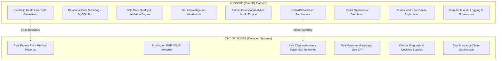
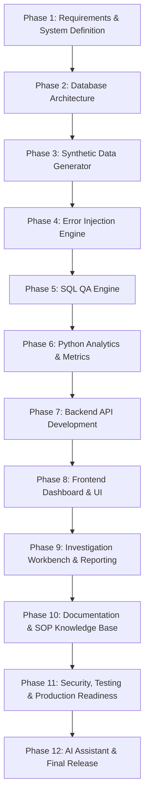

# ClaimIQ — Project Scope & Phase Dependency Roadmap

## 1. Project Boundaries: In-Scope vs. Out-of-Scope

To ensure precise engineering focus and strict adherence to healthcare data governance principles, ClaimIQ defines explicit operational boundaries.

### 1.1 In-Scope Capabilities
- **Synthetic Healthcare Data Architecture**: Highly realistic generation of patients, providers (NPIs), facilities, payers, encounters, claims, claim lines, payments, adjustments, and remittances.
- **Relational Data Integrity**: Comprehensive MySQL 8.x schema (InnoDB, utf8mb4) with referential constraints, indexing strategies, and migration tooling.
- **SQL Data Quality Engine**: Modular, version-controlled validation queries covering the 7 core healthcare data quality dimensions.
- **Synthetic Error Injection Suite**: Controlled, reproducible generation of edge cases, financial variances, temporal anomalies, and duplicate records.
- **Operations & Investigation Workbench**: Centralized web interface for searching, filtering, triaging, investigating, assigning, and resolving data quality issues.
- **Analytical & Reporting Engine**: Automated calculation of DQ Scores, Clean Claim rates, MTTR, Provider Quality Scorecards, and Payer Adjudication reports.
- **AI Operations Explainer**: Bounded local AI module that interprets verified SQL discrepancies and generates structured root-cause explanations and remediation steps.
- **Immutable Auditability**: Append-only event logging for all operational actions, status transitions, and data adjustments.

### 1.2 Out-of-Scope Capabilities
- **Protected Health Information (PHI)**: Ingesting, processing, or storing real HIPAA-regulated patient data.
- **Live Electronic Data Interchange (EDI)**: Real-time socket/SFTP connections to live commercial payer networks or clearinghouses.
- **Clinical & Diagnostic Decision Making**: Clinical triage, patient diagnosis, drug interaction checking, or treatment efficacy analysis.
- **Live Financial Transactions**: Real bank electronic fund transfers (EFT), credit card merchant processing, or live ledger disbursement.
- **Production Claims Adjudication**: Serving as an authoritative primary payer claims adjudication engine.

---

## 2. 12-Phase Project Dependency Roadmap

The ClaimIQ platform follows a phased, sequential engineering methodology. Each phase builds upon the verified specifications and deliverables of preceding phases.

### Phase-by-Phase Breakdown & Deliverables

| Phase # | Phase Title | Core Objectives & Deliverables | Primary Dependencies |
| :---: | :--- | :--- | :--- |
| **Phase 1** | **Domain Research, Project Scope & Requirements Definition** | Comprehensive documentation suite (16 docs), use cases, FRs, NFRs, DQ framework, RTM, completion criteria. | None (Foundational) |
| **Phase 2** | **Database Architecture & Data Modeling** | Relational DDL schema (MySQL 8.x, InnoDB), indexes, foreign keys, views, audit tables, reproducible SQL migrations. | Phase 1 Specifications |
| **Phase 3** | **Synthetic Data Generation Engine** | Python data generator (Faker/custom) producing realistic patients, providers, encounters, claims, claim lines, and payments. | Phase 2 Schema |
| **Phase 4** | **Controlled Error Injection Framework** | Systematic injector introducing targeted anomalies (duplicates, missing fields, financial variances, temporal bugs) at configurable rates. | Phase 3 Data Generator |
| **Phase 5** | **SQL QA Engine & Validation Rule Suite** | Modular SQL rule files, batch execution runner, telemetry logging, and automated issue record generation across 7 DQ dimensions. | Phase 2 Schema & Phase 4 Data |
| **Phase 6** | **Python Analytics & Metrics Computation** | Calculation engine for weighted DQ Scores, Clean Claim rates, MTTR, Provider/Payer distributions, and financial exposure rollups. | Phase 5 QA Output |
| **Phase 7** | **Backend API & Service Layer** | RESTful FastAPI backend implementing endpoints for claims, issues, rules, reports, audit logs, and user authentication. | Phase 2 Schema & Phase 6 Engine |
| **Phase 8** | **Frontend Dashboard & Core UI** | Responsive React/Vite web application with executive dashboard, claims explorer, filter controls, and visual KPI cards. | Phase 7 Backend API |
| **Phase 9** | **Investigation Workbench & Reporting Modules** | Deep-dive issue inspection UI, markdown note editor, status transition FSM, PDF/CSV report export engine. | Phase 8 Frontend UI |
| **Phase 10** | **SOP Documentation & Rule Knowledge Base** | In-app Rule Knowledge Base, interactive SOP viewer, and operational triage runbooks. | Phase 5 Rules & Phase 9 Workbench |
| **Phase 11** | **Security Hardening, Testing & CI/CD** | Automated unit/integration tests, role permission enforcement, deterministic regression suite, Docker containerization. | All Prior Phases |
| **Phase 12** | **AI Operations Assistant & Final Release** | Local LLM integration for verified issue explanation, automated root-cause synthesis, portfolio showcase packaging. | Complete Platform |
