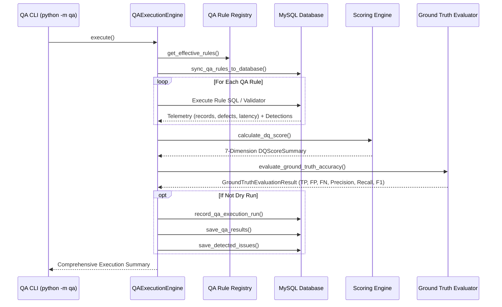

# ClaimIQ — QA Execution Engine & Telemetry Logging

## 1. Execution Workflow

The QA Engine execution cycle operates in an ACID-compliant, auditable pipeline:

---

## 2. Telemetry and Run Persistence Schema

### 1. `qa_execution_runs` Table
Captures batch-level execution metadata, start/end timestamps, total records evaluated, total defects detected, and the aggregate DQ score.

### 2. `qa_results` Table
Captures granular per-rule metrics including execution duration in milliseconds, records scanned, defect count, and execution status (`SUCCESS` / `SKIPPED`).

### 3. `issues` Table
Persists detected defect instances with severity codes, dimension codes, variance amounts, and initial status `Detected` for operational tracking.
