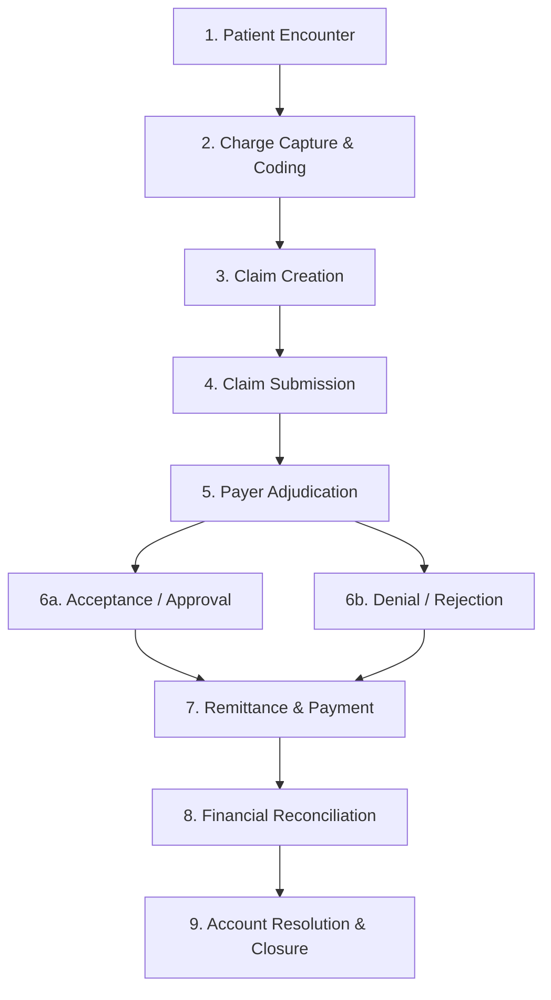

# ClaimIQ — Healthcare Revenue Cycle Management (RCM) Domain Overview

## 1. Introduction to Healthcare RCM

Healthcare Revenue Cycle Management (RCM) is the financial and operational process that healthcare organizations use to track patient care episodes from registration and appointment scheduling to final payment reconciliation and account balance resolution.

In a clinical and administrative setting, medical care provided by physicians, specialists, and facilities is translated into standardized billable claims submitted to third-party payers (commercial insurers, Medicare, Medicaid). The payer adjudicates the claim, determines reimbursement amounts according to contractual fee schedules, applies patient cost-sharing (deductibles, co-pays, co-insurance), and issues a remittance.

---

## 2. Simplified Healthcare Claims Lifecycle

The ClaimIQ platform models a realistic, structured 9-stage lifecycle:

### Stage-by-Stage Breakdown

1. **Patient Registration & Encounter**:
   - The patient registers, verifies synthetic insurance coverage, and receives medical services from a provider at a healthcare facility.
2. **Charge Capture & Medical Coding**:
   - The services rendered, procedures performed, and clinical conditions diagnosed are captured and translated into standardized healthcare code sets (CPT, HCPCS, ICD-10).
3. **Claim Creation (Synthetic EDI 837)**:
   - Charges are aggregated into a standardized claim record containing header details (patient ID, billing provider NPI, payer ID, total billed charge) and individual service line items.
4. **Claim Submission**:
   - The claim is electronically transmitted to the designated payer or clearinghouse with an assigned submission timestamp and tracking identifier.
5. **Payer Adjudication**:
   - The payer's automated rules engine reviews the claim against patient policy eligibility, medical necessity rules, network status, and benefit limits.
6. **Adjudication Outcome**:
   - **Accepted/Approved**: The claim meets all requirements and is scheduled for payment.
   - **Rejected**: The claim fails front-end validation (e.g., malformed member ID or invalid provider NPI) and is returned prior to formal adjudication.
   - **Denied**: The claim is formally processed but denied reimbursement (e.g., non-covered service, lack of prior authorization, timely filing limit exceeded).
7. **Payment, Adjustment & Remittance (Synthetic EDI 835 / ERA)**:
   - The payer issues an Electronic Remittance Advice (ERA) detailing payments made, contractual write-offs/adjustments, and patient responsibility balances.
8. **Financial Reconciliation**:
   - The provider's billing team matches the remittance against the original claim to verify the accounting balance equation:
     $$\text{Billed Amount} = \text{Paid Amount} + \text{Contractual Adjustment} + \text{Patient Responsibility}$$
9. **Resolution & Account Closure**:
   - Zero-balance claims are closed. Unresolved balances, incorrect denials, or payment variances are flagged for investigation, appeal, or secondary billing.

---

## 3. Core RCM Entities & Terminology

The table below outlines the 15 core entities modeled within ClaimIQ:

| Entity / Concept | Definition & Operational Context | Synthetic Model Role |
| :--- | :--- | :--- |
| **Patient** | The individual receiving healthcare services and holding insurance coverage. | Unique `patient_id`, demographics, synthetic policy holder ID. |
| **Provider** | The licensed clinician, physician, or practitioner rendering medical care. | Unique `provider_id`, 10-digit National Provider Identifier (`npi`), taxonomy code, specialty. |
| **Healthcare Organization / Facility** | The hospital, clinic, or medical group where encounters take place and billing originates. | Unique `facility_id`, organization name, billing tax ID (TIN). |
| **Payer / Insurance Company** | The commercial or government entity responsible for financing and adjudicating claims. | Unique `payer_id`, payer name, plan type (HMO, PPO, Medicare, Medicaid). |
| **Encounter** | A distinct clinical interaction between a patient and a provider on a specific date of service (DOS). | Unique `encounter_id`, date of service, service location, encounter type (Inpatient, Outpatient, Telehealth). |
| **Procedure & Diagnosis Codes** | Standardized medical terminology: CPT/HCPCS for procedures, ICD-10-CM for diagnoses. | `cpt_code` (5-digit procedural code), `icd10_code` (alphanumeric diagnostic code). |
| **Claim** | The comprehensive billing record submitted to a payer requesting reimbursement for an encounter. | Header record with `claim_id`, `encounter_id`, `patient_id`, `provider_id`, `payer_id`, `total_billed_amount`, `claim_status`, `submission_date`. |
| **Claim Line** | An individual billable service item or procedure within a claim. | `line_number`, `cpt_code`, `units`, `unit_price`, `line_billed_amount`. Sum of lines must equal claim header `total_billed_amount`. |
| **Payment** | The monetary amount disbursed by the payer to the provider for covered services. | `payment_id`, `paid_amount`, `payment_date`, `payment_method` (EFT/Check). |
| **Adjustment** | The contractual reduction or write-off between the provider's billed charge and the payer's allowed fee schedule. | `adjustment_amount`, adjustment group code (CO = Contractual Obligation, PR = Patient Responsibility). |
| **Denial** | Formal refusal by the payer to reimburse all or part of a submitted claim. | `denial_code`, `denial_reason` (e.g., PR-204, CO-16, CO-18), `denial_date`. |
| **Remittance (ERA / 835)** | The transaction document generated by the payer explaining payment, adjustment, and denial determinations. | `remittance_id`, `check_number`, `remittance_date`, `trace_number`. |
| **Claim Status** | The discrete lifecycle state of a claim in the operations pipeline. | `Submitted`, `Accepted`, `Rejected`, `Pending`, `Denied`, `Paid`, `Partially Paid`. |
| **Reconciliation** | The mathematical and operational process of balancing charges, payments, and adjustments. | Verifies $\Delta = \text{Billed} - (\text{Paid} + \text{Adjustment} + \text{PatientResp}) = 0$. |
| **Claim Dispute / Appeal** | The operational action taken when a denial or underpayment is challenged by the provider. | Tracking state for re-opened or re-adjudicated claims. |

---

## 4. Standard Healthcare Code Sets (Synthetic Representation)

ClaimIQ adopts standard healthcare coding syntax to ensure high realism:

1. **CPT (Current Procedural Terminology) / HCPCS**:
   - 5-digit alphanumeric codes representing clinical procedures (e.g., `99213` - Level 3 Outpatient Office Visit, `99214` - Level 4 Visit, `36415` - Routine Venipuncture).
2. **ICD-10-CM (International Classification of Diseases, 10th Revision)**:
   - Diagnostic codes format: Letter followed by 2 digits, dot, and up to 4 alphanumeric characters (e.g., `E11.9` - Type 2 diabetes mellitus without complications, `I10` - Essential hypertension).
3. **NPI (National Provider Identifier)**:
   - Standard 10-digit numeric format validated via Luhn algorithm (checksum prefix `80840`).
4. **CARC / RARC (Claim Adjustment Reason Codes & Remittance Advice Remark Codes)**:
   - Standardized codes explaining adjustments and denials (e.g., `CO-45`: Charge exceeds fee schedule/maximum allowable amount; `CO-16`: Claim lacks info needed for adjudication; `PR-1`: Deductible amount).

---

## 5. Scope & Realism Guarantees

While ClaimIQ strictly uses synthetic generation techniques, it accurately preserves:
- Relational integrity between patients, encounters, claims, claim lines, payments, and remittances.
- Chronological consistency across care delivery, billing, and adjudication timelines.
- Realistic financial distribution curves, denial rates (typically 5–12% in commercial pipelines), and adjustment ratios.
