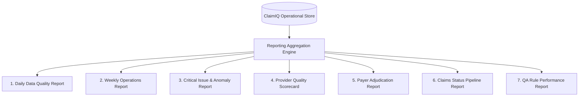

# ClaimIQ — Operational Reporting Requirements Specification

## 1. Reporting Architecture Overview

ClaimIQ provides an operational reporting suite designed to deliver operational visibility, executive oversight, and compliance auditing. Reports are generated from validated operational tables and pre-aggregated analytical views.

---

## 2. Detailed Report Specifications

### 2.1 Daily Data Quality Report (`REP-001`)
- **Purpose**: Provide a daily snapshot of dataset health, batch processing results, overall DQ score, and newly detected anomalies.
- **Target Audience**: Data Operations Analysts, Operations Managers, QA Leads.
- **Generation Frequency & Format**: Daily at 07:00 UTC; Web Dashboard, PDF Export, CSV Data Dump.
- **Required Metrics**:
  - Total Claims Ingested & Evaluated.
  - Overall Data Quality Score ($\%$).
  - Dimension Breakdown Scores (Accuracy, Completeness, Consistency, Validity, Uniqueness, Timeliness, Referential Integrity).
  - New Issues Detected Today (by Severity: Critical, High, Medium, Low).
  - Net Dollar Volume at Risk (sum of financial variances and overpayments).
- **Expected Operational Insights**: Immediate identification of sudden pipeline degradations or new upstream batch formatting failures.

---

### 2.2 Weekly Operations & Resolution Report (`REP-002`)
- **Purpose**: Track team operational performance, issue backlog health, resolution velocity, and SLA adherence.
- **Target Audience**: Operations Leadership, RCM Directors.
- **Generation Frequency & Format**: Weekly (Mondays 08:00 UTC); Web View, PDF, XLSX.
- **Required Metrics**:
  - Issues Opened vs. Issues Resolved (Net Backlog Change).
  - Mean Time to Resolution (MTTR) by Severity Level.
  - SLA Compliance Rate ($\%$ of issues resolved within target SLA window).
  - Backlog Aging Distribution ($<24\text{h}$, $1\text{–}3\text{d}$, $4\text{–}7\text{d}$, $>7\text{d}$).
  - Analyst Resolution Leaderboard (resolved issues count, root-cause notes completeness).
- **Expected Operational Insights**: Workload bottleneck identification, staffing balance, and SLA risk mitigation.

---

### 2.3 Critical Issue & Financial Anomaly Report (`REP-003`)
- **Purpose**: Detail high-risk financial discrepancies, overpayments, duplicate billings, and broken referential relationships requiring immediate remediation.
- **Target Audience**: Financial Controllers, Senior Operations Analysts, Audit Leads.
- **Generation Frequency & Format**: Real-time / Daily on-demand; Web View, CSV.
- **Required Metrics**:
  - List of active `Critical` and `High` severity issues.
  - Claim ID, Provider NPI, Payer ID, Billed Amount, Paid Amount, Variance ($\Delta$).
  - Primary Root-Cause Tag and Assigned Analyst.
  - Time elapsed since detection (aging timer).
- **Expected Operational Insights**: Direct prevention of cash leakage and audit vulnerability.

---

### 2.4 Provider Quality Scorecard (`REP-004`)
- **Purpose**: Evaluate and rank healthcare providers/facilities based on data completeness, coding accuracy, and error rates.
- **Target Audience**: Provider Relations Teams, RCM Operations Leads.
- **Generation Frequency & Format**: Monthly / On-demand; Web Dashboard, PDF.
- **Required Metrics**:
  - Provider Name, NPI, Facility, Specialty.
  - Total Submitted Claims Count & Total Billed Dollar Volume.
  - Error Rate ($\%$ of submitted claims with $\ge 1$ data quality defect).
  - Top Failing Rule Types per Provider (e.g., missing diagnosis, malformed modifier, duplicate submission).
  - Provider Quality Tier (Tier 1: $<2\%$ error rate, Tier 2: $2\text{–}5\%$, Tier 3: $>5\%$).
- **Expected Operational Insights**: Pinpoints specific clinic sites or clinical staff requiring targeted training on charge capture and coding standards.

---

### 2.5 Payer Adjudication & Error Report (`REP-005`)
- **Purpose**: Monitor payer performance, denial trends, adjustment consistency, and payment latency.
- **Target Audience**: Payer Relations Specialists, Financial Analysts.
- **Generation Frequency & Format**: Monthly; Web Dashboard, XLSX.
- **Required Metrics**:
  - Payer Name, Plan Type, Total Claims Processed.
  - Overall Denial Rate ($\%$), Clean Claim Pass Rate ($\%$).
  - Top 5 Denial CARC/RARC Codes by volume and dollar value.
  - Contractual Adjustment Ratio ($\frac{\text{Adjustments}}{\text{Total Billed}}$).
  - Average Days from Submission to Adjudication/Payment.
- **Expected Operational Insights**: Reveals hostile payer adjudication trends, uncontracted fee reductions, and adjudication timing lags.

---

### 2.6 Claims Status Pipeline Report (`REP-006`)
- **Purpose**: Visualize claim inventory distribution across the 7 lifecycle states.
- **Target Audience**: Billing Supervisors, Data Ops Analysts.
- **Generation Frequency & Format**: Real-time Daily; Visual Funnel / Pipeline Grid.
- **Required Metrics**:
  - Count and total dollar volume in each status: `Submitted`, `Accepted`, `Rejected`, `Pending`, `Denied`, `Paid`, `Partially Paid`.
  - Average Days in Status (Aging analysis).
  - Total Unreconciled Dollar Balance in active pipeline.
- **Expected Operational Insights**: Highlights operational bottlenecks (e.g., claims stuck in `Pending` medical review exceeding 30 days).

---

### 2.7 QA Rule Performance & Execution Report (`REP-007`)
- **Purpose**: Audit the efficiency, hit rate, and execution stability of individual SQL validation rules.
- **Target Audience**: QA Analysts, Data Engineers, System Administrators.
- **Generation Frequency & Format**: Weekly / Post-Batch Run; Web View, JSON/CSV.
- **Required Metrics**:
  - Rule ID, Rule Name, DQ Dimension, Default Severity.
  - Total Executions Count, Total Records Evaluated.
  - Hit Rate ($\%$ of records triggering the rule).
  - False Positive Rate ($\%$ of triggered issues marked as `False Positive`).
  - Average and p95 Execution Latency (milliseconds).
- **Expected Operational Insights**: Identifies underperforming, redundant, or overly broad rules requiring threshold tuning.

---

## 3. Reporting Summary Matrix

| Report Code | Report Title | Frequency | Key Audience | Format |
| :--- | :--- | :--- | :--- | :--- |
| `REP-001` | Daily Data Quality Summary | Daily | Data Ops / QA | Web / PDF / CSV |
| `REP-002` | Weekly Operations & SLA Report | Weekly | Ops Managers | Web / PDF / XLSX |
| `REP-003` | Critical Financial Anomaly Ledger | Real-time | Senior Analysts | Web / CSV |
| `REP-004` | Provider Quality Scorecard | Monthly | Provider Relations | Web / PDF |
| `REP-005` | Payer Adjudication & Denial Report | Monthly | Payer Relations | Web / XLSX |
| `REP-006` | Claims Status Pipeline Report | Daily | Billing Team | Web / Dashboard |
| `REP-007` | QA Rule Execution Performance | Post-Run | QA / SysAdmin | Web / JSON |
