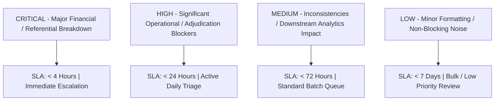
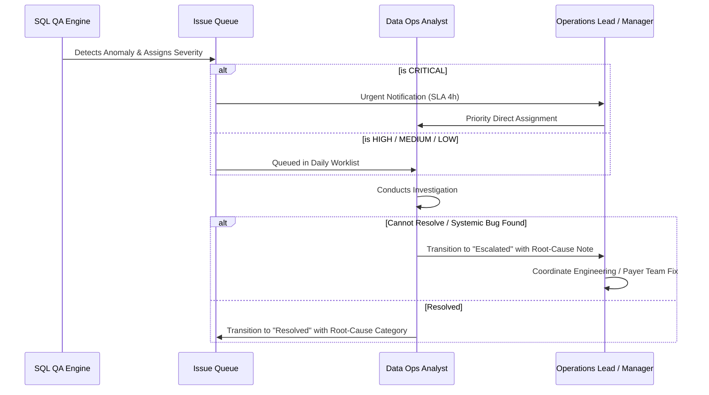

# ClaimIQ — QA Severity Model & Triage Framework

## 1. Severity Classification Overview

In high-volume healthcare data operations, treating all anomalies with equal urgency causes operational fatigue and delays resolution of high-risk financial and compliance defects.

ClaimIQ implements a 4-tier severity model:
- **CRITICAL**
- **HIGH**
- **MEDIUM**
- **LOW**

---

## 2. Severity Definitions & Criteria

| Severity Level | Operational Definition | Direct Business & Technical Impact | Target Examples in ClaimIQ |
| :--- | :--- | :--- | :--- |
| **CRITICAL** | High-impact systemic failure, major financial leak, or complete referential breakdown. | - Potential major financial loss or overpayment. - Broken database integrity (orphaned claims/payments). - Immediate regulatory/compliance vulnerability. | - $\text{Paid Amount} > \text{Billed Amount}$ (Overpayment). - Orphaned claim referencing non-existent patient/provider. - Payment recorded for a non-existent claim. - Negative financial values in master balances. |
| **HIGH** | Significant operational defect that directly prevents successful claim adjudication or indicates duplicate billing. | - 100% clearinghouse rejection rate. - Duplicate billing leading to payer fraud flags. - Critical temporal sequence violation. | - Duplicate claims submitted on same DOS. - Missing mandatory Provider NPI or Primary Diagnosis. - Submission date earlier than Date of Service. - Timely filing threshold exceeded (>365 days). |
| **MEDIUM** | Data inconsistency or business logic contradiction that distorts downstream reporting or AR aging without immediately halting claim delivery. | - Accounts Receivable (AR) balance mismatches. - Conflicting claim status versus payment record. - Discrepancy between claim header and line sums. | - Claim status marked `Paid` with \$0.00 payment. - Header billed amount $\neq$ sum of line items. - Claim status `Denied` with a positive payment. - Secondary phone/address formatting error. |
| **LOW** | Minor non-blocking data defect, cosmetic inconsistency, or non-critical optional attribute absence. | - Minimal operational disruption. - Cosmetic dashboard/reporting noise. - Non-essential demographic gaps. | - Missing optional secondary contact email. - Inconsistent casing in address string (`street` vs `St`). - Minor rounding variance ($< \$0.05) on non-balance line items. |

---

## 3. Operational Service Level Agreements (SLAs)

ClaimIQ defines standard resolution timelines and notification policies based on assigned severity:

| Severity Level | Initial Triage SLA | Target Resolution SLA | Escalation Trigger | Default Assignee Queue |
| :--- | :---: | :---: | :--- | :--- |
| **CRITICAL** | $\le 1$ hour | $\le 4$ hours | Unassigned after 2 hours or unresolved at 4 hours $\rightarrow$ Auto-escalate to Operations Manager | Senior Data Ops Lead / Financial Analyst |
| **HIGH** | $\le 4$ hours | $\le 24$ hours | Unresolved after 24 hours $\rightarrow$ Alert Team Lead | Data Operations Analyst Queue |
| **MEDIUM** | $\le 12$ hours | $\le 72$ hours | Unresolved after 5 business days $\rightarrow$ Batch review flag | General Operations Queue |
| **LOW** | $\le 24$ hours | $\le 7$ business days | Unresolved after 14 business days $\rightarrow$ Auto-suppression review | QA Analyst / Junior Queue |

---

## 4. Triage & Escalation Workflow

### Escalation Criteria
An issue must be transitioned to the `Escalated` status under the following conditions:
1. **Systemic Ingestion Failure**: The defect is identified as an upstream ETL/converter software bug affecting $>100$ claims simultaneously.
2. **Payer Adjudication Discrepancy**: Remittance data from a specific payer violates contracted fee schedules across multiple providers.
3. **SLA Breach**: Critical or High severity issues approaching SLA deadlines without a confirmed resolution pathway.
