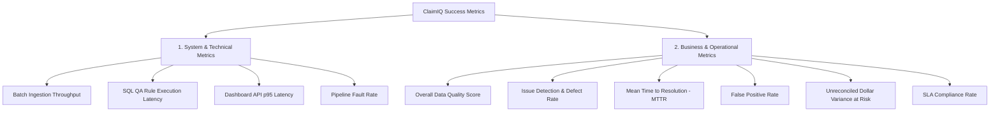

# ClaimIQ — Success Metrics & KPI Framework

## 1. Metrics Framework Overview

To evaluate both technical performance and operational business impact, ClaimIQ establishes a dual-tier metrics framework:
1. **System & Technical Performance Metrics**: Measuring the computational throughput, query efficiency, data integrity, and reliability of the platform.
2. **Business & Operational RCM Metrics**: Measuring the effectiveness of data quality validation, defect resolution velocity, financial risk mitigation, and team productivity.

---

## 2. System & Technical Performance Metrics

| Metric Identifier | Metric Name | Definition & Calculation Formula | Benchmark Target |
| :--- | :--- | :--- | :---: |
| **SYS-MET-01** | **Batch QA Execution Speed** | Total elapsed time required to execute the full suite of active SQL QA rules across a batch of 100,000 synthetic records. | **$< 30$ seconds** |
| **SYS-MET-02** | **Dashboard Query Latency ($p95$)** | 95th-percentile response time for core analytics and summary dashboard API requests under standard load. | **$< 200$ ms** |
| **SYS-MET-03** | **Search & Filter Latency** | Query execution time for multi-attribute filtered claims/issues queries across 1,000,000 indexed records. | **$< 300$ ms** |
| **SYS-MET-04** | **Rule Determinism Rate** | Percentage of consecutive QA runs on identical datasets yielding identical result hashes. | **$100.0\%$** |
| **SYS-MET-05** | **System Availability** | Service uptime for database, API, and dashboard during active operational windows. | **$\ge 99.9\%$** |
| **SYS-MET-06** | **Pipeline Error Isolation** | Percentage of single-rule runtime failures that are isolated without crashing the parent batch process. | **$100.0\%$** |

---

## 3. Business & Operational RCM Metrics

| Metric Identifier | Metric Name | Definition & Calculation Formula | Operational Benchmark |
| :--- | :--- | :--- | :---: |
| **BIZ-MET-01** | **Data Quality (DQ) Score** | Weighted composite score across all 7 data quality dimensions:$$\text{DQ Score} = \sum_{i=1}^{7} w_i \cdot \left(1 - \frac{\text{Failures}_i}{\text{Total}}\right) \times 100\%$$ | **$\ge 95.0\%$** (Production Grade) |
| **BIZ-MET-02** | **Clean Claim Pass Rate** | Percentage of submitted claims passing all completeness, validity, and referential checks on initial batch run:$$\text{Clean Rate} = \frac{\text{Claims with 0 Defects}}{\text{Total Ingested Claims}} \times 100\%$$ | **$\ge 90.0\%$** |
| **BIZ-MET-03** | **Issue Detection Rate (Defect Density)** | Average number of data quality issues detected per 1,000 processed claims. | Standard baseline: $20\text{–}60 / \text{k}$ |
| **BIZ-MET-04** | **Critical Issue Ratio** | Percentage of detected issues classified as `Critical` severity:$$\text{Critical Ratio} = \frac{\text{Critical Issues Count}}{\text{Total Issues Count}} \times 100\%$$ | **$< 5.0\%$** |
| **BIZ-MET-05** | **Mean Time to Resolution (MTTR)** | Average hours elapsed from issue detection to verified resolution:$$\text{MTTR} = \frac{\sum (\text{Resolved Timestamp} - \text{Detected Timestamp})}{\text{Total Resolved Issues}}$$ | **Critical: $< 4$h** **High: $< 24$h** **Medium: $< 72$h** |
| **BIZ-MET-06** | **Operational SLA Compliance Rate** | Percentage of total issues resolved within their designated SLA time window:$$\text{SLA Compliance} = \frac{\text{Issues Resolved within SLA}}{\text{Total Resolved Issues}} \times 100\%$$ | **$\ge 95.0\%$** |
| **BIZ-MET-07** | **False Positive Rate (FPR)** | Percentage of detected issues investigated and marked as `False Positive`:$$\text{FPR} = \frac{\text{False Positive Count}}{\text{Total Investigated Issues}} \times 100\%$$ | **$< 3.0\%$** (indicates well-tuned rules) |
| **BIZ-MET-08** | **Financial Variance at Risk** | Total dollar amount associated with active, unresolved financial discrepancies:$$\text{Dollar at Risk} = \sum \left|\text{Billed} - (\text{Paid} + \text{Adj} + \text{PatResp})\right|$$ | Monitored daily; target **$\rightarrow \$0.00$** |
| **BIZ-MET-09** | **Provider Defect Concentration** | Percentage of total detected issues originating from the top 10% worst-performing provider NPIs (Pareto analysis). | Identifies target training opportunities |
| **BIZ-MET-10** | **Investigation Completeness Rate** | Percentage of resolved issues containing complete root-cause categorization and descriptive remediation notes. | **$100.0\%$** |

---

## 4. Metric Tracking & Dashboard Integration

These metrics are continuously calculated and exposed across three primary platform layers:
1. **Real-Time Operational Triage Bar**: Shows live DQ Score, Critical Issues Count, and Financial Variance at Risk.
2. **Operations Management Dashboard**: Visualizes MTTR trends, SLA compliance rates, and queue velocity.
3. **Weekly & Monthly Executive Exports**: Consolidates provider scorecards, payer denial trends, and system performance benchmarks.
