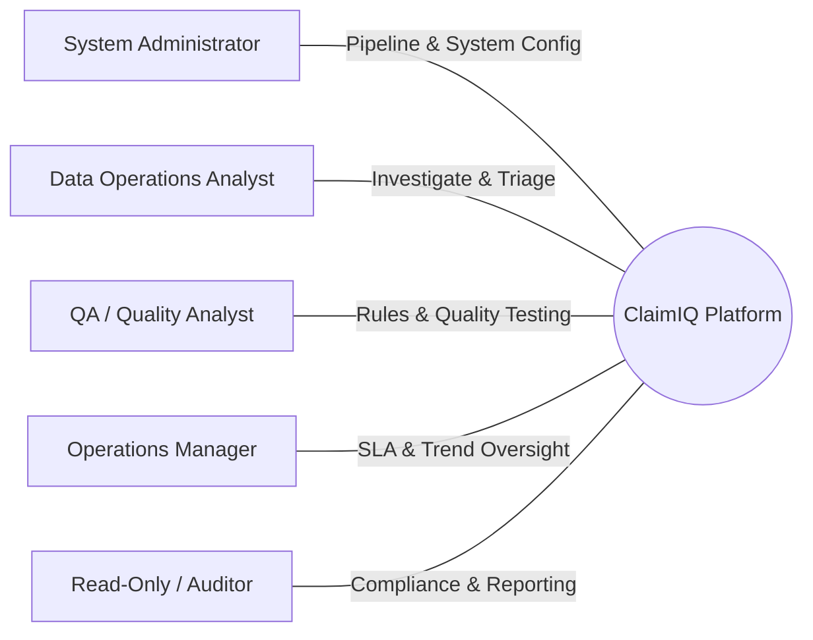

# ClaimIQ — Users & Roles Specification

## 1. User Personas Overview

ClaimIQ defines five distinct user roles tailored to healthcare data operations, quality assurance, operations leadership, and auditing. Each role has well-defined operational responsibilities, data access boundaries, and permissible actions.

---

## 2. Detailed Role Profiles

### 2.1 Data Operations Analyst (Primary Operator)

- **Role Summary**: Front-line analyst responsible for daily operational data monitoring, triage of detected discrepancies, root-cause investigation of claims anomalies, and tracking issues to resolution.
- **Key Responsibilities**:
  - Review daily batch data quality outputs and newly detected issue queues.
  - Investigate referential, temporal, financial, and formatting defects in claims data.
  - Document root-cause findings, evidence, and corrective action recommendations.
  - Assign issues to domain specialists or escalate systemic anomalies.
  - Update issue lifecycle states (`Open` $\rightarrow$ `Investigating` $\rightarrow$ `Resolved` / `Escalated` / `False Positive`).
- **Information Required**:
  - Full access to synthetic claim headers, claim lines, encounters, providers, payers, and payment transactions.
  - Detailed issue logs with rule violation details, query results, and historical claims context.
- **Permitted Actions**:
  - Search, filter, and view claims, encounters, and payments.
  - Create, claim, assign, update, and resolve data quality issues.
  - Add investigation notes, root-cause tags, and remediation documentation.
  - Export filtered issue lists and investigation summaries.
- **Restricted Actions**:
  - Cannot alter or delete raw ingestion datasets or audit logs.
  - Cannot modify or delete core system QA rule definitions without QA approval.
  - Cannot create or modify user accounts.

---

### 2.2 QA / Quality Analyst (Data Integrity Specialist)

- **Role Summary**: Specialist responsible for defining, validating, calibrating, and auditing data quality rules across the 7 DQ dimensions.
- **Key Responsibilities**:
  - Review and calibrate QA validation rules and threshold parameters.
  - Evaluate false-positive and false-negative rates across rule sets.
  - Verify data integrity across new synthetic batch releases.
  - Conduct regression tests on the SQL QA engine.
- **Information Required**:
  - Access to rule definitions, execution metrics, error distribution tables, and rule latency stats.
  - Historical data quality scorecards and batch test results.
- **Permitted Actions**:
  - Author, test, and activate/deactivate data quality validation rules.
  - Trigger manual or ad-hoc QA rule batch executions.
  - Flag issues as `False Positive` and document rule tuning rationale.
  - Generate QA Rule Performance & Execution reports.
- **Restricted Actions**:
  - Cannot delete production audit history.
  - Cannot perform user provisioning.

---

### 2.3 Operations Manager (Team & SLA Oversight)

- **Role Summary**: Operational leader overseeing RCM throughput, team SLA adherence, error resolution velocity, and recurring defect trends.
- **Key Responsibilities**:
  - Monitor aggregate data quality scores and financial exposure from unresolved defects.
  - Supervise analyst workloads, queue depths, and Mean Time to Resolution (MTTR).
  - Review escalated critical issues and coordinate process improvements with provider/payer teams.
  - Review executive and weekly operational reports.
- **Information Required**:
  - High-level dashboards: Daily DQ scores, issue severity distributions, queue aging, and team resolution velocity.
  - Provider and Payer quality scorecards showing error concentrations.
- **Permitted Actions**:
  - Reassign issues across team members and approve escalated resolutions.
  - Schedule and export executive summary and weekly operations reports.
  - View all claims, issues, and audit logs.
- **Restricted Actions**:
  - Cannot modify raw claims data.
  - Cannot directly edit system infrastructure configuration.

---

### 2.4 System Administrator (Platform & Pipeline Engineer)

- **Role Summary**: Technical administrator responsible for system health, data ingestion pipelines, execution scheduling, security parameters, and user access management.
- **Key Responsibilities**:
  - Manage synthetic data ingestion batch runs and pipeline triggers.
  - Monitor system performance, query execution latency, and error logs.
  - Provision user accounts, assign role memberships, and maintain security configurations.
  - Maintain database indexes, backups, and environment settings.
- **Information Required**:
  - System performance metrics, pipeline execution logs, database telemetry, and security access logs.
- **Permitted Actions**:
  - Full system administration capabilities: user management, role assignments, pipeline triggers, configuration edits.
  - Trigger full batch runs and database maintenance routines.
- **Restricted Actions**:
  - Prohibited from altering tamper-evident audit log records.

---

### 2.5 Read-Only / Reporting User (Auditor & Executive)

- **Role Summary**: Stakeholder or external auditor requiring visibility into data quality metrics, compliance reports, and audit trails without operational edit capabilities.
- **Key Responsibilities**:
  - Review compliance logs, audit trails, and historical data quality scorecards.
  - Verify adherence to documented data quality standards and standard operating procedures (SOPs).
- **Information Required**:
  - Read-only access to dashboards, reports, aggregate statistics, and audit trails.
- **Permitted Actions**:
  - View dashboards, claims records, issue history, and audit trails.
  - Export standard reports to PDF/CSV/Excel.
- **Restricted Actions**:
  - Cannot create, edit, assign, or resolve issues.
  - Cannot modify rule configurations, system parameters, or claims data.

---

## 3. Role-Based Access Control (RBAC) Matrix

The table below details permissions across core ClaimIQ functional areas:

| Functional Area / Action | Data Ops Analyst | QA Analyst | Operations Manager | System Admin | Read-Only User |
| :--- | :---: | :---: | :---: | :---: | :---: |
| **View Claims & Encounters** | Read | Read | Read | Read | Read |
| **View Issue Queue & Details** | Read | Read | Read | Read | Read |
| **Create / Claim / Edit Issue** | Full | Full | Full | Full | None |
| **Resolve / Close Issue** | Full | Full | Full | Full | None |
| **Mark Issue as False Positive** | Read (Suggest) | Full | Full | Full | None |
| **Escalate Issue** | Full | Full | Full | Full | None |
| **Execute QA Rule Batches** | Execute Only | Full | Execute Only | Full | None |
| **Create / Modify QA Rules** | None | Full | Read Only | Full | None |
| **View Operational Reports** | Read | Read | Read | Read | Read |
| **Export Reports / Datasets** | Full | Full | Full | Full | Full |
| **View System Audit Logs** | Read | Read | Read | Read | Read |
| **User & Role Administration** | None | None | None | Full | None |
| **Pipeline & System Config** | None | None | None | Full | None |

---

## 4. Operational Boundaries & Separation of Duties

1. **Separation of QA Rule Authoring and Pipeline Execution**:
   - QA Analysts design and validate rules; System Admins schedule pipeline automation, ensuring rule changes are vetted before production execution.
2. **Investigation Accountability**:
   - Every issue status change (`Open` $\rightarrow$ `Investigating` $\rightarrow$ `Resolved`) requires an assigned analyst ID and timestamped investigation notes.
3. **Immutable Audit Trails**:
   - No user role (including System Administrator) can truncate or modify historical audit log entries, guaranteeing complete traceability for regulatory and operational auditing.
