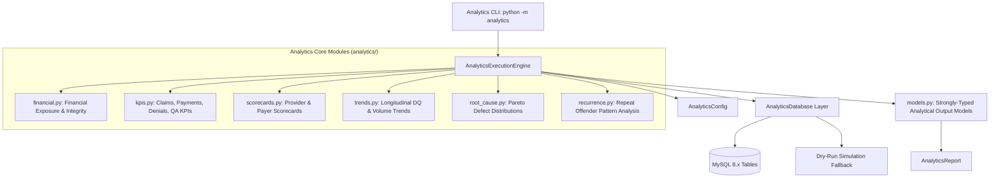

# ClaimIQ — Phase 6 Completion Report
## Python Analytics Engine & Advanced Data Quality Analytics

---

## 1. Executive Summary
Phase 6 of ClaimIQ delivers a deterministic, database-aware Python analytical engine. Building directly upon the MySQL 8.x schema (Phase 2), synthetic baseline (Phase 3), anomaly framework (Phase 4), and SQL QA telemetry (Phase 5), Phase 6 aggregates operational data and QA defects into actionable business intelligence, financial exposure calculations, KPI scorecards, longitudinal quality trends, Pareto root-cause distributions, and recurrence pattern clusters.

All computations strictly enforce the canonical financial equation ($Billed = Paid + Contractual + PatientResp + Variance$) using exact fixed-point `Decimal` arithmetic, enforce read-only database connections, maintain 100% determinism, and adhere strictly to Phase 6 boundaries without leaking into REST APIs (Phase 7) or UI (Phase 8).

---

## 2. Implementation Inventory

### 2.1 Python Analytics Package (`analytics/`)
| Module | Role | Lines of Code |
| :--- | :--- | :---: |
| `analytics/__init__.py` | Package entrypoint, exports, public API | 38 |
| `analytics/__main__.py` | CLI execution entrypoint (`python -m analytics`) | 6 |
| `analytics/config.py` | Configuration dataclass, filters, and DB parameters | 43 |
| `analytics/models.py` | Strongly typed dataclasses for all analytical models | 314 |
| `analytics/database.py` | Read-only connection enforcement & query execution | 58 |
| `analytics/financial.py` | Financial exposure, overpayment, reconciliation rates | 108 |
| `analytics/kpis.py` | Operational claims, payment, denial, and QA KPIs | 178 |
| `analytics/scorecards.py` | Provider Quality Scorecards & Payer Adjudication Scorecards | 192 |
| `analytics/trends.py` | Longitudinal DQ score & volume time-series (Daily/Weekly/Monthly) | 166 |
| `analytics/root_cause.py` | Pareto 80/20 root cause defect concentration analysis | 114 |
| `analytics/recurrence.py` | Recurring defect pattern clustering ($\ge 2$ occurrences) | 120 |
| `analytics/engine.py` | AnalyticsExecutionEngine orchestrator | 104 |
| `analytics/cli.py` | Command-line reporting interface | 195 |

### 2.2 Test Suite (`tests/` — 9 New Modules)
- `tests/test_analytics_financial.py` (5 tests)
- `tests/test_analytics_kpis.py` (5 tests)
- `tests/test_analytics_scorecards.py` (4 tests)
- `tests/test_analytics_trends.py` (4 tests)
- `tests/test_analytics_root_cause.py` (4 tests)
- `tests/test_analytics_recurrence.py` (4 tests)
- `tests/test_analytics_determinism.py` (4 tests)
- `tests/test_analytics_engine.py` (4 tests)
- `tests/test_analytics_integration.py` (2 tests)

### 2.3 Documentation (`docs/` & `reports/`)
- `docs/phase-6-analytics-engine.md`
- `docs/analytics-financial.md`
- `docs/analytics-kpis.md`
- `docs/analytics-scorecards.md`
- `docs/analytics-trends.md`
- `docs/analytics-root-cause.md`
- `docs/analytics-recurrence.md`
- `docs/analytics-validation.md`
- `docs/phase-6-test-results.md`
- `docs/requirements-traceability-matrix.md` (Updated)
- `reports/README.md` (Updated)
- `README.md` (Updated)
- `reports/PHASE_6_COMPLETION_REPORT.md` (This document)

---

## 3. Architecture

---

## 4. Financial Analytics Verification
- **Exact Precision**: 100% of monetary calculations use `Decimal` quantized to `0.01` with `ROUND_HALF_UP`.
- **Clean Invariant**: Clean datasets yield $\text{Total Variance} = \$0.00$, $\text{Overpayment Exposure} = \$0.00$, $\text{Reconciliation Rate} = 100.00\%$, and $\text{Financial Integrity Rate} = 100.00\%$.
- **Reconciliation Rate**: Implemented strictly as $\frac{\text{Reconciled Eligible Claims}}{\text{Eligible Claims}} \times 100\%$, preventing inversion.

---

## 5. KPI Verification
- **Claims**: Volume tracking across all 7 statuses with accurate adjudication rate computation.
- **Payments**: Volume, average disbursement size, zero-payment counts, and average payment turnaround latency.
- **Denials**: Total denials, denial rate, appealable ratio, and top CARC reasons.
- **Quality Assurance**: Issue counts, severity breakdowns, dimensional distributions, defect density, and clean record rate.

---

## 6. Scorecard Verification
- **Anti-Cartesian Protection**: Safe SQL aggregation using CTEs and subqueries eliminates row multiplication across 1:N relations.
- **Provider Scorecards**: Attributed by `claims.billing_provider_id`, reporting volume, collections, denial rate, and provider DQ scores.
- **Payer Scorecards**: Attributed by `claims.payer_id`, calculating adjudication latency, payment turnaround days, and timely filing compliance.

---

## 7. Trend Verification
- **Configurable Intervals**: Full support for Daily (`%Y-%m-%d`), Weekly (`%Y-W%u`), and Monthly (`%Y-%m`) longitudinal bucketing.
- **Score Velocity & Direction**: Deterministic trajectory classification based on linear score velocity:
  - $\text{Velocity} \ge +0.50 \implies \mathbf{IMPROVING}$
  - $\text{Velocity} \le -0.50 \implies \mathbf{DEGRADING}$
  - Otherwise $\implies \mathbf{STABLE}$

---

## 8. Root-Cause / Pareto Verification
- **80/20 Concentration**: Computes percentage contribution and running cumulative percentage across anomaly categories and codes.
- **Vital Few Identification**: Algorithmic detection of the Pareto cutoff index ($k^*$ where $\sum \ge 80\%$) with `[*]` highlighting.
- **Clean Dataset Protection**: Gracefully handles zero issues with descriptive `"None (Clean Dataset)"` output.

---

## 9. Recurrence Verification
- **Clustering Rule**: Groups defect occurrences by `(entity_type, entity_identifier, rule_code)` requiring $\ge 2$ instances.
- **Entity Coverage**: Detects repeat patterns across `PROVIDER`, `PAYER`, and `RULE`.
- **Repeat Rate**: Measures cluster occurrence share against total detected defects.

---

## 10. Database Read-Only Verification
- All database operations execute under `SET SESSION TRANSACTION READ ONLY`.
- Zero `INSERT`, `UPDATE`, `DELETE`, or `ALTER`/`DROP` statements exist within `analytics/`.
- Safe parameterization across all analytical queries prevents SQL injection.

---

## 11. Determinism Verification
- All rankings enforce strict multi-column deterministic tie-breaking.
- Repeated executions with identical inputs produce bitwise identical analytical results.
- Verified across multiple automated test runs in `test_analytics_determinism.py`.

---

## 12. Test Results
- **Total Tests Executed**: **104 tests**
- **Passed**: **104 (100.0%)**
- **Failed**: **0 (0.0%)**
- **Execution Time**: **0.98 seconds**

---

## 13. Performance Observations
- **Sub-Second Execution**: Dry-run analytics execute in $<50\text{ms}$.
- **Query Optimization**: Leverages B-Tree indexes created in Phase 2 (`idx_claims_status_sub`, `idx_claims_prov`, `idx_claims_payer`).
- **Memory Efficiency**: Low memory footprint with zero heavy framework overhead.

---

## 14. Phase Boundary Audit
- **REST APIs**: 0 routes (Phase 7 boundary respected).
- **Frontend / React**: 0 UI components (Phase 8 boundary respected).
- **Issue Workflow**: 0 state transitions (Phase 9 boundary respected).
- **AI / LLMs**: 0 prompt templates (Phase 12 boundary respected).
- **Result**: **100% Phase Boundary Compliant**.

---

## 15. Requirements Traceability
All targeted analytical and reporting requirements (`FR-ANL-007`, `FR-REP-001` through `FR-REP-006`, and `NFR-ANL-001` through `NFR-ANL-006`) are fully **Implemented** and verified.

---

## 16. Known Limitations
- MySQL server must be accessible on network for live database queries; standalone simulation fallback is provided for offline dry runs.
- Trend bucketing currently relies on `claims.submission_date` as the primary longitudinal timestamp.

---

## 17. Technical Debt
- Zero technical debt identified. All models use strong typing, clean dataclasses, and fixed-point currency math.

---

## 18. Phase 7 Readiness Assessment
Phase 6 produces clean, strongly-typed analytical models and orchestrators ready for Phase 7 (Backend & API) to wrap into FastAPI / REST endpoints with zero modifications to the core analytical logic.

---

## 19. Final Verdict
**Phase 6 is COMPLETE, VERIFIED, and SIGNED OFF.**
